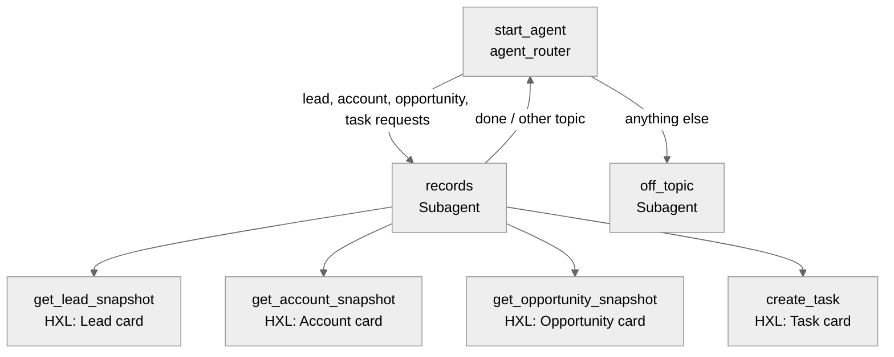

# Agent Spec: AFD360_HXL_Agent

## Purpose & Scope

A small employee agent for the AFD360_Utilities test bench. It returns Salesforce records as structured
action output rendered through HXL widgets, and it creates Tasks reliably over the Agent API, which the
Coworker can't do (see `docs/bug-coworker-create-record-agent-api.md`). It is not a replacement for the
Coworker: it covers only leads, accounts, opportunities and tasks.

## Behavioral Intent

- Look up a record before showing it. Ask for a name when the request is ambiguous, and never invent records.
- Show the record card produced by the action instead of retyping the fields in prose. Add one short
  sentence at most.
- Create a Task only when there is a subject. Resolve "related to" and "name" with the lookup actions first.
- Backing logic: invocable Apex only, using `WITH USER_MODE` queries and a direct insert for Task (no
  layout lookup).
- Off-topic requests get a brief reply saying what the agent can do.

## Subagent Map

## Variables

None. Every action is stateless, and the model carries IDs from one action's output to the next turn.

## Actions & Backing Logic

| Action | Target | Status | Inputs | Output (shown to user) | Rendering |
|---|---|---|---|---|---|
| get_lead_snapshot | `apex://AFD360LeadSnapshot` | EXISTS | leadId, leadName | lead (`@apexClassType/c__AFD360LeadSnapshot$Snapshot`) | `c__afd360LeadSnapshotCard` (exists) |
| get_account_snapshot | `apex://AFD360AccountSnapshot` | NEEDS STUB | accountId, accountName | account: name, type, industry, owner, phone, website, open opp count/amount, record URL | new CLT `c__afd360AccountSnapshotCard` + widget |
| get_opportunity_snapshot | `apex://AFD360OpportunitySnapshot` | NEEDS STUB | opportunityId, opportunityName | opportunity: name, account, stage, amount, close date, probability, owner, record URL | new CLT `c__afd360OpportunitySnapshotCard` + widget |
| create_task | `apex://AFD360CreateTask` | NEEDS STUB | subject (req), whatId, whoId, status, priority, activityDate, description | task: id, subject, status, priority, due date, related-to and name labels, record URL | new CLT `c__afd360TaskCard` + widget |

Every output object uses `filter_from_agent: False` and `is_displayable: True`, with
`complex_data_type_name` set to the action's card CLT. Each new class gets a test class.

For the MCP and AFD360 chat surfaces, each new card also gets the MCP pair (a result-wrapper CLT plus a
payload CLT), added as tools and resources on the existing `AFD360Demo` MCP server. Salesforce serves the
widget HTML only for MCP-declared resources, and the AFD360 chat renders cards by that route.

## Gating Logic

- `create_task` is available only when the subject is known. The `records` subagent's instructions
  enforce this (the model collects the subject first). There is no variable gate.

## Architecture Pattern

Hub-and-spoke. `agent_router` sends to `records` or `off_topic`, and `records` returns to the router.

## Agent Configuration

- **developer_name:** `AFD360_HXL_Agent`
- **agent_label:** `AFD360 HXL Agent`
- **agent_type:** `AgentforceEmployeeAgent`. It is used by employees through the Agent API ECA
  (`bypassUser: false`) and in Lightning.
- **default_agent_user:** N/A, because this is an employee agent.
- **Permissions:** runs as the logged-in or Run As user (admin@finsdc3.demo). The new Apex classes need
  access in that user's permission set or profile, granted through a small `AFD360_HXL_Agent_Access`
  permission set.

## Rollout order

1. Create Task card and action, Account card and Opportunity card: Apex and tests, then widgets, then
   CLTs, then MCP tools.
2. Authoring bundle: validate, then live preview with `--use-live-actions`.
3. Publish and activate, with your OK at the checkpoint.
4. AFD360 chat: render action outputs whose type has an HXL widget inline through the existing MCP Apps
   host. Verify end to end with "show me Omega, Inc. and its top opportunity" and "create a task…".
