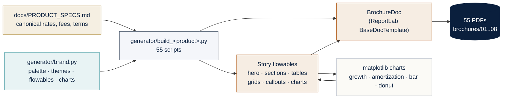
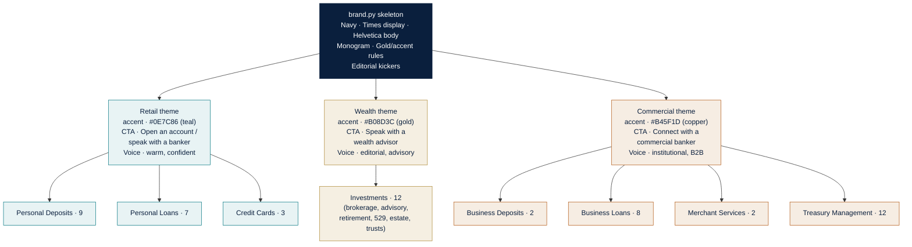
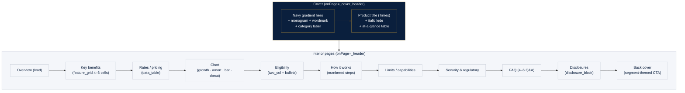
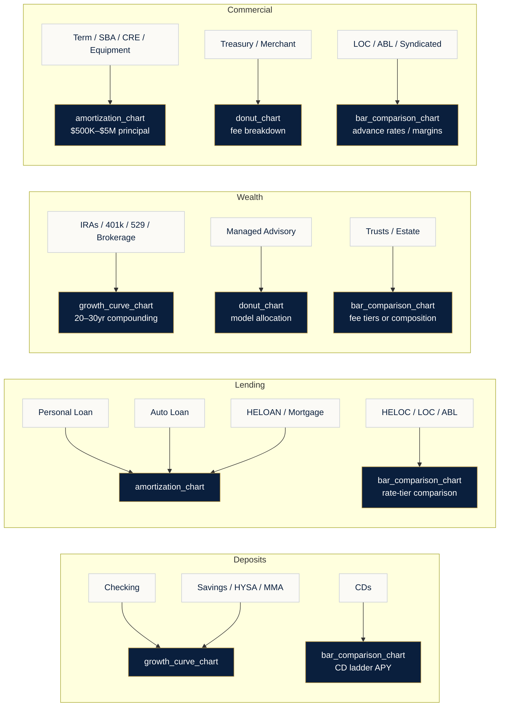

# Cumulus Products — Diagrams

Mermaid diagrams describing the brochure generation system and the brand segmentation model. Rendered natively on GitHub.

---

## 1. Generation pipeline

From a product-spec document to a 55-PDF catalog via a shared brand system.

---

## 2. Segment theme matrix

One brand skeleton, three accent themes. Each product is assigned a segment at generator time via `B.set_theme("retail" | "wealth" | "commercial")`.

---

## 3. Brochure layout (per product)

Standard structure composed from brand-module flowables; length adapts to product complexity (typically 3–9 pages).

---

## 4. Chart selection by product family

Each brochure embeds at least one matplotlib chart. Type is chosen to match the financial question the product raises.

