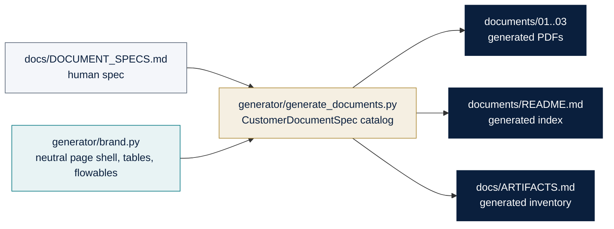
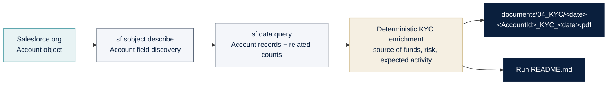
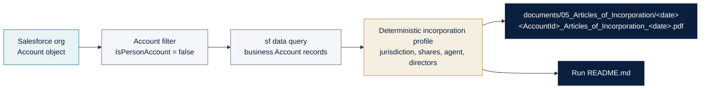
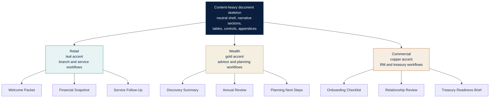
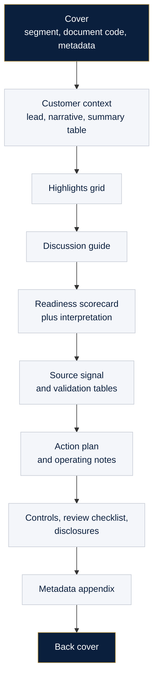

# Customer Documents - Diagrams

Mermaid diagrams for the customer-document generation system.

## 1. Generation pipeline

## 1b. Salesforce-backed KYC generation

## 1c. Salesforce-backed Articles of Incorporation generation

## 2. Segment theme matrix

## 3. Document layout

