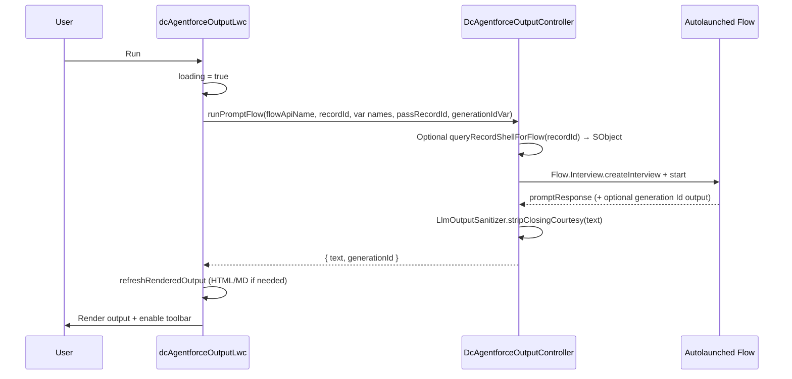
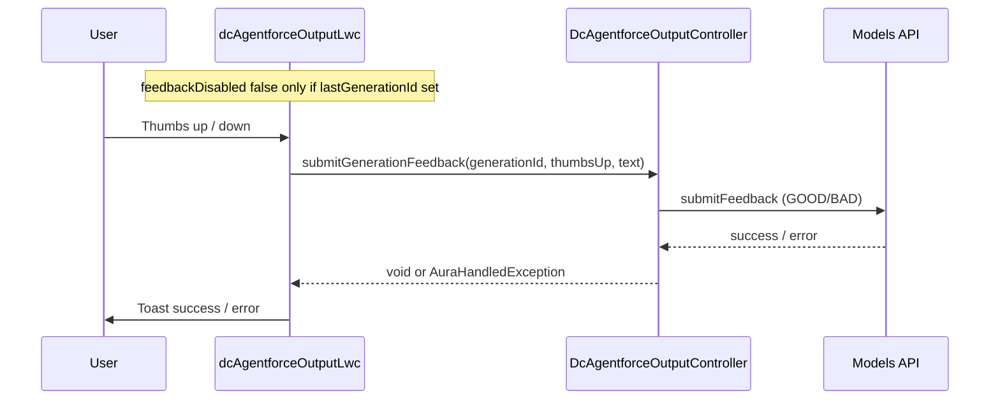
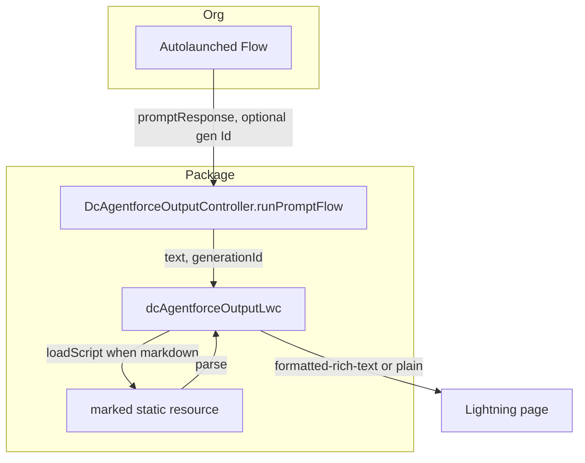
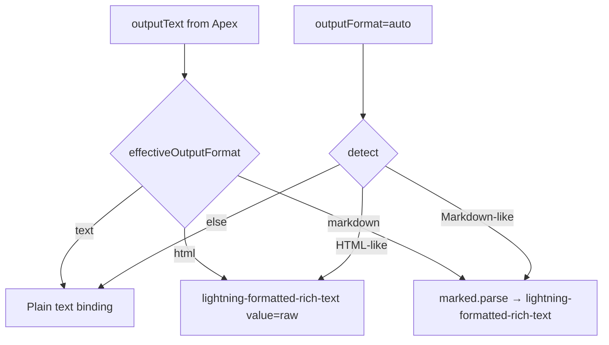

# Architecture

Behavior of **DC AgentForce Output** (`dcAgentforceOutputLwc`) and **DcAgentforceOutputController**. Paths: [GIT.md](GIT.md).

---

## Layers

| Layer | Responsibility |
|-------|----------------|
| **LWC (main)** | Designer properties, Run/auto-run, output rendering (plain vs `lightning-formatted-rich-text`), Markdown via **marked**, clipboard + modals, print, thumbs UI. |
| **LWC (modals)** | Expand view; copy fallback when nested clipboard policies block programmatic copy. |
| **Apex** | Start autolaunched Flow with correct **SObject** shape for Record inputs; read text outputs; optional `LlmOutputSanitizer`; Models API feedback. |
| **Static resource** | **marked** UMD bundle for Markdown parsing. |
| **Flow (org)** | Gen AI / assignments; must expose **promptResponse** (Text) and optionally **generation Id** (Text). |

---

## Sequence: user clicks Run

---

## Sequence: thumbs feedback

---

## Data flow (high level)

---

## Output format decision (client)

---

## Title color (LEX-safe)

The title uses a **CSS custom property** on the root `<article class="lwc-shell">`:

- Inline: `--dc-output-title-color: #RRGGBB;`
- Rule: `.lwc-shell__title { color: var(--dc-output-title-color, #032d60); }`

This avoids theme overrides that ignore `style={object}` on nested headings.

---

## Related reading

- [FLOW_GUIDE.md](FLOW_GUIDE.md) — variable names and Record input typing
- [COMPONENT_REFERENCE.md](COMPONENT_REFERENCE.md) — all properties
- [artifacts.md](../artifacts.md) — file list
