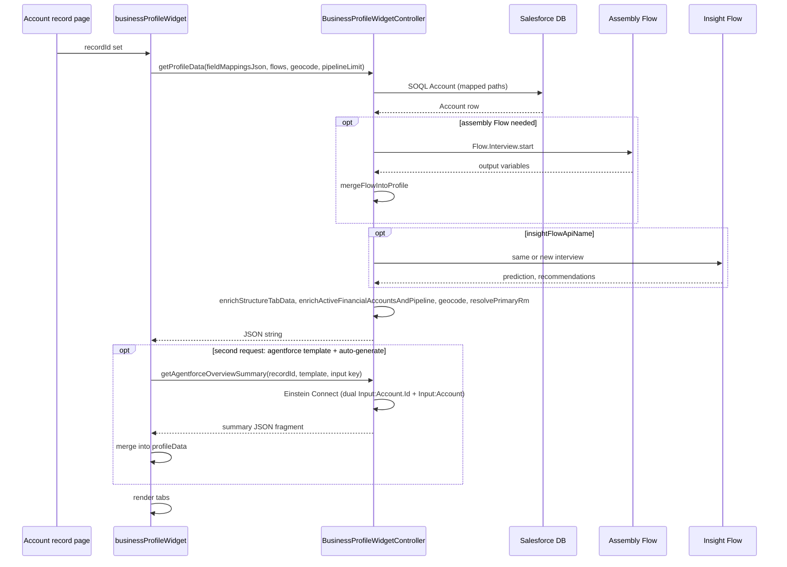

# Architecture — Business Profile Widget

Plain-language view of how data reaches the card.

---

## Overview

1. User opens an **Account** record; the platform sets **`recordId`** on the LWC.  
2. **`businessProfileWidget`** calls **`BusinessProfileWidgetController.getProfileData`** with **`fieldMappingsJson`** (built from every **Field: …** `@api` property), assembly Flow name, optional Insight Flow names, **`geocodeBillingAddress`**, and **`pipelineOpportunityLimit`** (from the **Pipeline: max open opportunities** property: **0** or omitted → server uses up to **2000** open Opportunities). When **Agentforce summary** template Id is set and **auto-generate** is not false, it then calls **`getAgentforceOverviewSummary`** in a **second** Apex request (Einstein only — avoids mixing Connect with the heavy profile transaction).  
3. Apex **`buildFromSoql`** queries **Account** with columns inferred from non-`flow:` mappings.  
4. **`mergeFlowIntoProfile`** runs the assembly Flow when needed and copies **`flow:`** outputs into **`BusinessProfileResult`** (via `getVariableValue` with tolerant name matching).  
5. When configuration blocks Flow assembly (for example any `flow:` mapping but a blank assembly API name), the flow faults, or **interest expense** is `flow:`-mapped but Apex still has no numeric value after a successful interview, Apex sets **`assemblyFlowHint`** on the result; the LWC shows it as an orange note under **Liquidity waterfall**.  
5b. **`mergeAgentforceSummaryFromPromptTemplate`** (optional) calls **`ConnectApi.EinsteinLLM.generateMessagesForPromptTemplate`** when **Agentforce summary: prompt template ID** is set and **auto-generate** is not false; passes the **Account Id** to the configured prompt input (not a prediction JSON) and overwrites **`agentforceSummary`** on success (failures are logged only).  
6. **`mergeInsightFromFlow`** adds prediction and recommendations (reusing the assembly interview when API names match).  
7. **`enrichStructureTabData`** loads key contacts and related-account org chart data.  
8. **`enrichActiveFinancialAccountsAndPipeline`** (best effort) sets **`activeProducts`** from active **FinServ Financial Accounts** when available, **`activeProductsReflectsFinancialAccounts`**, and **`pipelineOpenOpportunities`** for open **Opportunities** on the Account (SOQL **`LIMIT`** from **`pipelineOpportunityLimit`**, max **2000**, ordered by amount descending then name).  
9. Optional **geocode** runs if coordinates are missing and geocoding is enabled.  
10. **`primaryRm`** may resolve from User Id to display name.  
11. The controller returns **JSON**; the LWC **`JSON.parse`**s it and renders.

---

## Security

- Controller is **`with sharing`**.  
- Users need read access to Account and related records used in SOQL and Flow.

---

## Sequence diagram

---

[FLOW_GUIDE.md](FLOW_GUIDE.md) · [APEX_REFERENCE.md](APEX_REFERENCE.md)
