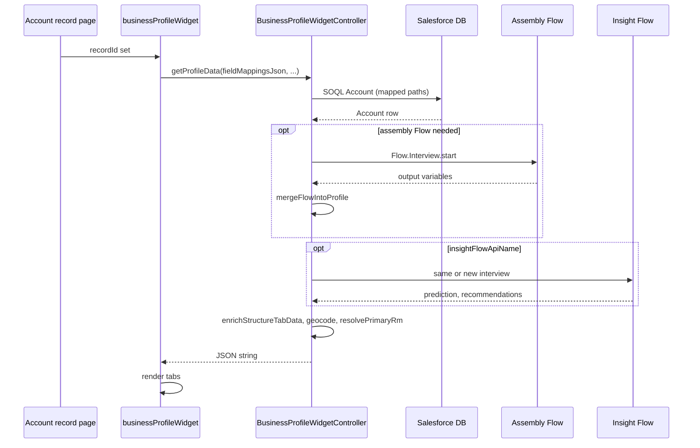

# Architecture — Business Profile Widget

Plain-language view of how data reaches the card.

---

## Overview

1. User opens an **Account** record; the platform sets **`recordId`** on the LWC.  
2. **`businessProfileWidget`** calls **`BusinessProfileWidgetController.getProfileData`** with **`fieldMappingsJson`** (built from every **Field: …** `@api` property), assembly Flow name, and optional Insight Flow names.  
3. Apex **`buildFromSoql`** queries **Account** with columns inferred from non-`flow:` mappings.  
4. **`mergeFlowIntoProfile`** runs the assembly Flow when needed and copies **`flow:`** outputs into **`BusinessProfileResult`**.  
5. **`mergeInsightFromFlow`** adds prediction and recommendations (reusing the assembly interview when API names match).  
6. **`enrichStructureTabData`** loads key contacts and related-account org chart data.  
7. Optional **geocode** runs if coordinates are missing and geocoding is enabled.  
8. **`primaryRm`** may resolve from User Id to display name.  
9. The controller returns **JSON**; the LWC **`JSON.parse`**s it and renders.

---

## Security

- Controller is **`with sharing`**.  
- Users need read access to Account and related records used in SOQL and Flow.

---

## Sequence diagram

---

[FLOW_GUIDE.md](FLOW_GUIDE.md) · [APEX_REFERENCE.md](APEX_REFERENCE.md)
