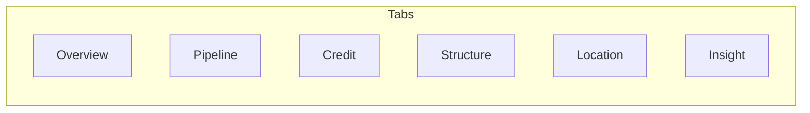
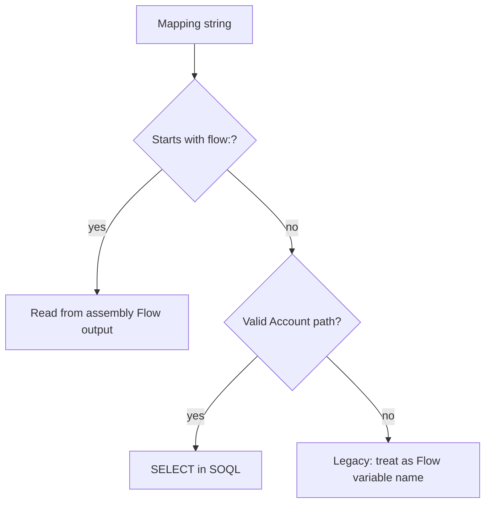

# Diagrams — Business Profile Widget

## Tabs (default visibility)

Each tab can be hidden with the matching **Show … tab** property.

---

## Field source decision (conceptual)

Exact behavior is implemented in **`BusinessProfileWidgetController`** (`buildFromSoql`, `mergeFlowIntoProfile`, `isFlowToken`).

---

[ARCHITECTURE.md](ARCHITECTURE.md)
