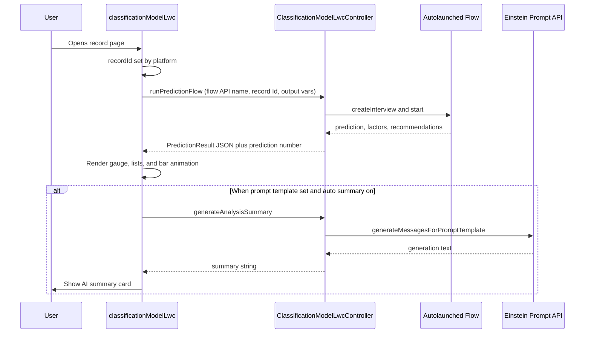
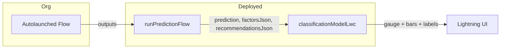

# Architecture

High-level behavior of **Classification Model** (`classificationModelLwc`) and **ClassificationModelLwcController**.

---

## Component responsibilities

| Layer | Responsibility |
|-------|------------------|
| **LWC** | Renders gauge, driver/recommendation lists, summary; maps designer properties to Apex; parses JSON for lists; applies colors and animations. |
| **Apex** | Runs flow with safe variable naming; serializes flow outputs to strings; invokes Einstein prompt API with a wrapped text parameter. |
| **Flow** (org) | Encapsulates record-scoped prediction and shapes `factors` / `recommendations` for the UI. |
| **Prompt template** (org) | Turns JSON context into user-facing narrative (optional). |

---

## Sequence: record page load



---

## Data flow (prediction → UI)



---

## Summary payload (Apex → prompt)

Apex builds **one JSON string** and passes it to the flex text input (API name from LWC, default `Input:Prediction_Context`):

```json
{
  "prediction": 51.58,
  "factors": "[...]",
  "recommendations": "[...]"
}
```

`factors` and `recommendations` are **strings** (often stringified JSON arrays). The prompt template should treat them as text or parse them inside the template instructions.

---

## Error handling

| Failure | User-visible behavior |
|---------|------------------------|
| Flow missing / runtime error | Toast: “Could not run prediction flow”; sticky message with detail. |
| Summary / Einstein error | Toast: “AI summary failed”; main gauge/lists may still show if flow succeeded. |
| No `recordId` | Flow is not called (silent skip). |
| No `flowApiName` | Flow is not called. |

---

## Gauge rendering note

Arc **color** comes from the LWC getter `gaugeArcSolidColor` (template-bound `stroke`). **Dash offset** is animated in JS. Inline `stroke` is cleared in `renderedCallback` so App Builder changes to reverse/bad/good colors apply reliably after refresh.

---

## Related docs

- [FLOW_GUIDE.md](FLOW_GUIDE.md) — Flow contract
- [PROMPT_TEMPLATE_GUIDE.md](PROMPT_TEMPLATE_GUIDE.md) — Template inputs
- [COMPONENT_REFERENCE.md](COMPONENT_REFERENCE.md) — All properties
