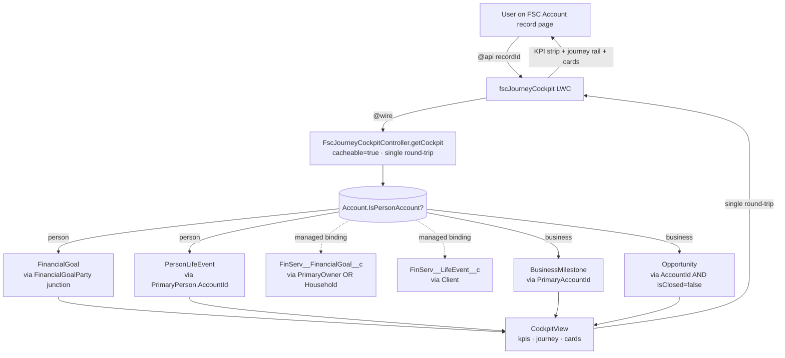

# DC_Goals_Cockpit_lwc

> **FSC Journey Cockpit** — a Lightning Web Component that replaces the stock FSC *Life Events* / *Business Milestones* and *Financial Goals* sections on Account record pages with a single unified card.

<div align="center">

[](https://developer.salesforce.com/developer-centers/salesforce-dx)
[](sfdx-project.json)
[](#testing)
[](#testing)
[](#testing)
[](#)
[](force-app/main/default/lwc/fscJourneyCockpit/cockpitThemes.js)
[](#)

</div>

---

## What it does

One card, three sections:

| Section | Person Account | Business Account |
|---|---|---|
| **KPI strip** (top) | Goals · Avg funded · Total tracked · Next deadline | Open deals · Pipeline · Weighted · Next close |
| **Journey rail** (left, 300px) | Life Events from `PersonLifeEvent` (or managed `FinServ__LifeEvent__c`) | Business Milestones from `BusinessMilestone` |
| **Adaptive panel** (right) | Financial Goals via `FinancialGoalParty` junction (or managed `FinServ__FinancialGoal__c`) | Open Opportunities |

Each rail step and card is interactive:

- **Click the title** → navigate to the record (cmd+click opens new tab)
- **Hover** → popover shows record details + per-event description, "+ New" button, and "Open record" link
- **Hover a grouped step** (`x2`/`x3` badge) → popover lists every event on that date with its own link
- **▾ chevron on goal/opp cards** → action menu: View · Edit · Clone · Delete (Esc closes)
- **+ New / + Goal / + Opportunity buttons** in section headers → standard "Create" dialog for the right object per binding mode

Built to participate in the JDO record-page theme system — flipping `themeMode` retheme this card alongside `multiclassPredictionLwc`, `customerProfileWidget`, and `businessProfileWidget`. 43 themes available.

---

## Quick start

```bash
# Install dev dependencies (jest, eslint, prettier)
npm install

# Run the local Jest suite (30 tests, ~0.7s)
npm test

# Deploy to the default org (set with `sf config set target-org`)
sf project deploy start --source-dir force-app/main/default --wait 10 --concise

# Deploy + run the Apex test class
sf project deploy start --source-dir force-app \
  --test-level RunSpecifiedTests \
  --tests FscJourneyCockpitControllerTest --wait 30
```

> **Use `sf` (CLI v2)**, not `sfdx`. The `sfdx` commands are deprecated.

---

## Architecture



Component is a dumb renderer: KPI math, priority-chip mapping, journey completion, group rollups, and `recordUrl` minting all happen in Apex.

---

## FlexiPage placement

1. **Setup** → **Lightning App Builder** → open an Account record page
2. Drag **FSC Journey Cockpit** onto the canvas (typically replacing the stock Goals + Life Events components)
3. Configure design attributes in the right rail:

| Attribute | Default | Notes |
|---|---|---|
| `goalBinding` | `standard` | `standard` matches FSC native FinancialGoals component (via `FinancialGoalParty` junction). `managed` for orgs with FSC managed package data only. |
| `lifeEventBinding` | `standard` | `standard` reads `PersonLifeEvent` (via `PrimaryPerson.AccountId`). `managed` reads `FinServ__LifeEvent__c` (via `Client`). |
| `cardColumns` | `2` | 1, 2 (default), or 3 |
| `maxJourneyItems` | `20` | Cap on rail items (controller still fetches up to 50) |
| `themeMode` | `default` | One of 43 family themes — see [`cockpitThemes.js`](force-app/main/default/lwc/fscJourneyCockpit/cockpitThemes.js) |
| `accentColor` | (blank) | `#RRGGBB` or `#RRGGBBAA` to override gold accent |
| `showThemeSwitcher` | `false` | Renders 4 quick-switch buttons in the header — demos only |

4. Save and Activate
5. Assign the **DC Goals Cockpit User** permission set to standard users (admins included so non-admin users see populated panels): `sf org assign permset --name DC_Goals_Cockpit_User --on-behalf-of <username>`

> ⚠ The `default="standard"` only applies on **first placement**. If you previously dropped the cockpit on a FlexiPage with the old `default="managed"`, you must edit that FlexiPage and flip both binding attributes to `standard` manually — defaults don't retroactively override existing instances.

---

## Resolved object/field bindings

| Logical | `goalBinding=standard` (default) | `goalBinding=managed` |
|---|---|---|
| Object | `FinancialGoal` | `FinServ__FinancialGoal__c` |
| Account filter | `WHERE Id IN (SELECT FinancialGoalId FROM FinancialGoalParty WHERE AccountId = :rid)` | `WHERE FinServ__PrimaryOwner__c = :rid OR FinServ__Household__c = :rid` |
| Actual / target / date | `ActualAmount` / `TargetAmount` / `TargetDate` | `FinServ__ActualValue__c` / `FinServ__TargetValue__c` / `FinServ__TargetDate__c` |
| Priority chip | native `Priority` (HIGH/MEDIUM/LOW → mapped to High/Medium/Low for chip CSS) | derived from `FinServ__Status__c` (Not Started → neutral, In Progress → Medium, Completed → green) |
| Volume in jdo-uqj0jr | matches FSC native widget | 21× more raw rows but no Priority field |

| Logical | `lifeEventBinding=standard` (default) | `lifeEventBinding=managed` |
|---|---|---|
| Object | `PersonLifeEvent` | `FinServ__LifeEvent__c` |
| Account filter | `WHERE PrimaryPerson.AccountId = :rid` | `WHERE FinServ__Client__c = :rid` |
| `eventDate` | `EventDate` (DateTime, controller `.date()`s it) | `FinServ__EventDate__c` (Date) |
| `eventType` | `EventType` | `FinServ__EventType__c` |
| Description | `Name` (e.g. "Appointed CEO Morris Roasters") | `Name` |

Always-standard sources:

- **Business journey** → `BusinessMilestone` (`PrimaryAccountId`, `MilestoneDate`, `MilestoneType`, `Name`)
- **Opportunity panel** → `Opportunity` (`AccountId = :rid AND IsClosed = false`; `Probability` drives the bar; `StageName` is the chip)

---

## Caveats

- **The `default="standard"` only applies to new placements.** Existing FlexiPage instances keep the value baked in at original placement time. If you placed the cockpit before v1.1, edit the FlexiPage and flip both bindings manually.
- **Switching `lifeEventBinding` can surface dual-write divergence.** `PersonLifeEvent` and `FinServ__LifeEvent__c` were brought to parity once via the `mirror-life-events` CLI (~25K rows), but no trigger keeps them in sync. Events created on one stack post-backfill won't appear on the other.
- **Stage→progress mapping uses `Opportunity.Probability` directly.** The org has 94 active stages — a fixed map breaks. `Probability` is auto-synced by Salesforce from each stage's configured value and stays correct as ops adds new stages.
- **The native FSC related list shows ~80 rows for Omega Inc, the cockpit shows 2.** That related list is reading **Data Cloud** (Data Source: `Salesforce_Home`), not Salesforce SObjects. Matching it would require a DC Connect API integration — explicitly out of scope for v1.x.

---

## Theming

This LWC participates in the JDO record-page theme family (`--wp-*` tokens). Setting `themeMode` on the FlexiPage retheme this card alongside `multiclassPredictionLwc`, `customerProfileWidget`, and `businessProfileWidget`. The design mock's tokens (`--gold`, `--ink`, `--paper`, `--line`) are aliased to `--wp-*` on `:host` so the CSS reads like the mock while resolution flows through the family system.

`cockpitThemes.js` carries the inline 43-theme palette (matches `multiclassPredictionLwc/predictionThemes.js`) and adds three cockpit-specific tokens per theme: `--wp-progress-good`, `--wp-progress-blue`, `--wp-rail-pending`. **Keep the palette in sync with siblings** — if you tune a token in one, tune it in all three (multiclass, prediction model, cockpit).

---

## Testing

| Suite | Tests | Coverage | Run |
|---|---|---|---|
| **Apex** | 19/19 passing | 83% on `FscJourneyCockpitController` | `sf apex run test --tests FscJourneyCockpitControllerTest --result-format human --code-coverage --wait 10` |
| **Jest** | 30/30 passing (~0.8s) | n/a | `npm test` |

Coverage: ≥85% target — currently 83% (12 lines short, all in `goalIconFor` keyword branches). Achieved without the FSC Person Account record-type entitlement dance by:

- Direct `@TestVisible` exercise of inner methods (`loadGoalCards`, `computeGoalKpis`, etc.)
- Re-using an existing Person Account at test time (any FSC org has at least one); tests `return;` silently if zero exist

For deeper context, see [`AGENTS.md`](AGENTS.md).

---

## Related projects

- [**`DC_Multiclass_Prediction_LWC`**](../DC_Multiclass_Prediction_LWC/) — palette twin. The cockpit's 43-theme palette is kept in sync with its `predictionThemes.js`.
- [**`DC_BusinessProfileWidget`**](../DC_BusinessProfileWidget/), [**`DC_PersonProfileWidget`**](../DC_PersonProfileWidget/) — same `--wp-*` token vocabulary; pair on a FlexiPage for a coherent record page.
- [**`DC_AgentForce_Output_LWC`**](../DC_AgentForce_Output_LWC/) — same JDO LWC lifecycle conventions (`_isConnected`, RAF-deferred theme application, `_lastAppliedThemeKey`, `buildAuraException` helper).

---

## Documentation

| File | Topic | Audience |
|---|---|---|
| [`README.md`](README.md) | This file — overview, quick start, FlexiPage placement | Developers, evaluators |
| [`docs/SETUP_GUIDE.md`](docs/SETUP_GUIDE.md) | Step-by-step admin runbook: deploy → permset → place → configure → verify (with SOQL sanity queries + troubleshooting table) | **Salesforce admins** |
| [`AGENTS.md`](AGENTS.md) | Architecture deep-dive, conventions, traps, testing patterns | AI coding agents, contributors |
| [`CHANGELOG.md`](CHANGELOG.md) | Keep-a-Changelog format; v1.0 → v1.1 history | Anyone tracking iterations |
| [`artifacts.md`](artifacts.md) | Inventory of every deployable metadata artifact + deploy snapshot | DevOps, release engineers |
| [`design/fsc-cockpit.html`](design/fsc-cockpit.html) | Approved design mock (visual source of truth) | Designers, QA |
