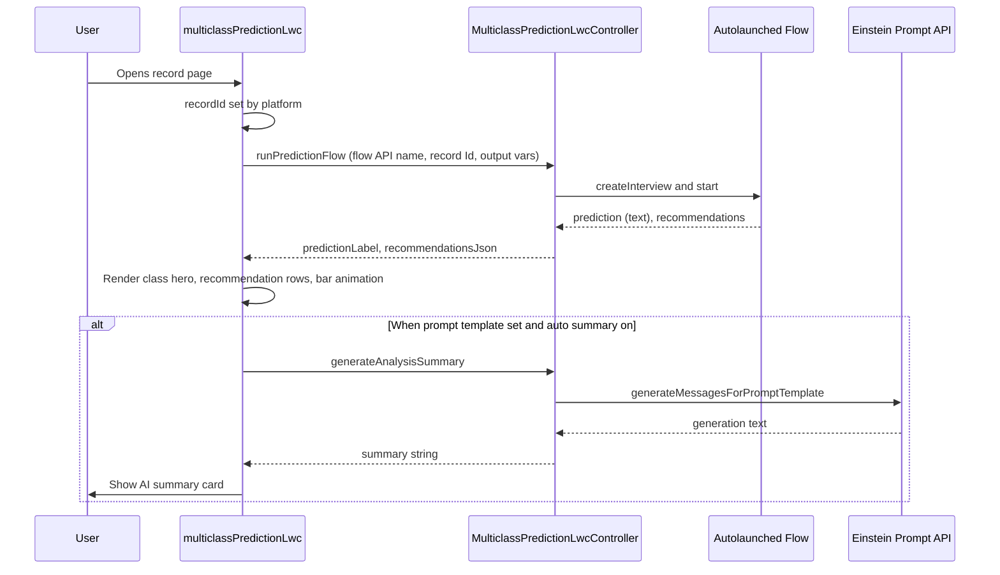
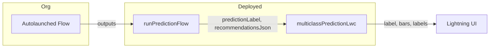

# Architecture

High-level behavior of **Multiclass Prediction** (`multiclassPredictionLwc`) and **`MulticlassPredictionLwcController`**. **Git / path:** [GIT.md](GIT.md).

---

## Component responsibilities

| Layer | Responsibility |
|-------|----------------|
| **LWC** | Renders **predicted class** as large text (with optional humanize), **recommendations** list with bars, optional summary; maps designer properties to Apex; parses JSON for recommendations. |
| **Apex** | Runs flow with safe variable naming; coerces prediction to text; serializes recommendations to a string; invokes Einstein prompt API with a wrapped text parameter. |
| **Flow** (org) | Encapsulates record-scoped multiclass prediction and shapes `recommendations` for the UI. |
| **Prompt template** (org) | Turns JSON context into user-facing narrative (optional). |

---

## Sequence: record page load



---

## Data flow (prediction → UI)



---

## Summary payload (Apex → prompt)

Apex builds **one JSON string** and passes it to the flex text input (API name from LWC, default `Input:Prediction_Context`):

```json
{
  "prediction": "Wealth_Management",
  "predictionType": "multiclass_label",
  "recommendations": "[{\"fields\":[...],\"value\":317.61}, ...]"
}
```

- `prediction` is always a **JSON string** (the raw label from the flow before LWC humanize).
- `predictionType` is always **`multiclass_label`** so the template can branch from regression/classification payloads.
- `recommendations` is a **string** (often stringified JSON array). The prompt can parse it or treat it as opaque text.

---

## Error handling

| Failure | User-visible behavior |
|---------|------------------------|
| Flow missing / runtime error | Toast: “Could not run prediction flow”; sticky message with detail. |
| Summary / Einstein error | Toast: “AI summary failed”; class and recommendations may still show if flow succeeded. |
| No `recordId` | Flow is not called (silent skip). |
| No `flowApiName` | Flow is not called. |

---

## Main prediction rendering

- **Class hero:** `.class-hero-panel` wraps `.class-hero` with `.class-hero__label` (large text, `word-break`) and `.class-hero__caption` (subtitle).
- **Recommendations:** Same row pattern as the sibling project (delta %, bar, field detail); bars animate via `transform: scaleX` after load.

Full DOM and CSS overview: [UI_LAYOUT.md](UI_LAYOUT.md).

---

## Related docs

- [GIT.md](GIT.md) — Git layout, clone path, naming
- [UI_LAYOUT.md](UI_LAYOUT.md) — Class hero, captions, responsive rules
- [FLOW_GUIDE.md](FLOW_GUIDE.md) — Flow contract
- [PROMPT_TEMPLATE_GUIDE.md](PROMPT_TEMPLATE_GUIDE.md) — Template inputs
- [COMPONENT_REFERENCE.md](COMPONENT_REFERENCE.md) — All properties
