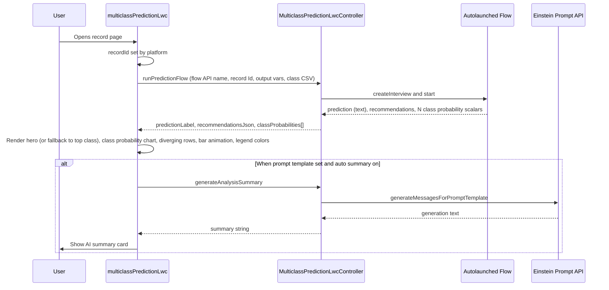
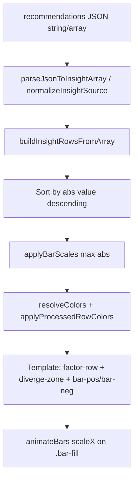
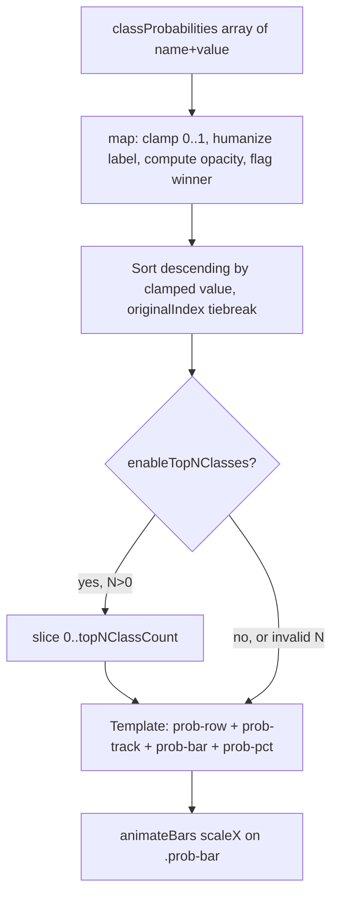

# Architecture

High-level behavior of **Multiclass Prediction** (`multiclassPredictionLwc`) and **`MulticlassPredictionLwcController`**. **Git / path:** [GIT.md](GIT.md).

---

## Component responsibilities

| Layer | Responsibility |
|-------|----------------|
| **LWC** | Renders **predicted class** as large text (with optional humanize, accent-tinted hero), **class probabilities** as a sorted theme-accent bar chart with opacity gradient + winner highlight + optional top-N slice, **feature contributions** as a **diverging bar chart** (SHAP-style scores, legend tied to bar colors), optional summary; maps designer properties to Apex; parses JSON for recommendations; coerces per-class numeric values; applies **`THEMES`** from **`predictionThemes.js`** (profile-aligned CSS variables, optional header theme switcher). |
| **Apex** | Runs flow with safe variable naming; coerces prediction to text; serializes recommendations to a string; **parses class-variable CSV and reads each scalar Flow output**, coercing to `Decimal` (Double routes through `String.valueOf` to avoid binary float artifacts); invokes Einstein prompt API with a wrapped text parameter. |
| **Flow** (org) | Encapsulates record-scoped multiclass prediction and shapes `recommendations` for the UI. |
| **Prompt template** (org) | Turns JSON context into user-facing narrative (optional). |

---

## Sequence: record page load



---

## Data flow (prediction → UI)

```mermaid
flowchart LR
    subgraph Org
        F[Autolaunched Flow]
    end
    subgraph Deployed
        A[runPredictionFlow]
        L[multiclassPredictionLwc]
    end
    F -->|outputs| A
    A -->|predictionLabel, recommendationsJson, classProbabilities[]| L
    L -->|hero label, class probability chart, diverging bars, legend, summary| UI[Lightning UI]
```

---

## Recommendations: client-side pipeline (UI)

After flow data arrives, the LWC derives rows for the chart (conceptual steps):



- **Display values** are shown as **±x.x** (one decimal, Unicode minus for negatives) — raw model contributions, **not** percentages.
- **Legend** getters (`legendSupportsDotStyle`, `legendAgainstDotStyle`) use the same **risk/good** pairing as positive- vs negative-direction bars.

---

## Class probabilities: client-side pipeline (UI)

Per-class scalars from Apex are sorted, decorated for rendering, and optionally sliced to top-N:



- **Bar length:** `scaleX(probability)` — a 0.99 row fills 99% of the track (absolute, not relative to max).
- **Opacity gradient:** `0.35 + 0.65 × probability` so zero-probability rows stay faintly visible while the top class is fully solid.
- **Winner detection:** `apiName.toLowerCase() === resolvedWinnerApiName.toLowerCase()` — case-insensitive to match the Apex `resolveFlowOutput` casing tolerance. The hero label and the highlighted row both read from `resolvedWinnerApiName`, so they cannot disagree.
- **Reduced motion:** `@media (prefers-reduced-motion: reduce)` forces `.prob-bar` to `scaleX(1)` so bars are visible even if the JS animation is suppressed.

---

## Summary payload (Apex → prompt)

Apex builds **one JSON string** and passes it to the flex text input (API name from LWC, default `Input:Prediction_Context`):

```json
{
  "prediction": "Wealth_Management",
  "predictionType": "multiclass_label",
  "recommendations": "[{\"fields\":[...],\"value\":317.61}, ...]"
}
```

- `prediction` is always a **JSON string** (the raw label from the flow before LWC humanize).
- `predictionType` is always **`multiclass_label`** so the template can branch from regression/classification payloads.
- `recommendations` is a **string** (often stringified JSON array). The prompt can parse it or treat it as opaque text.
- **Class probabilities are NOT currently included in the prompt payload.** They render in the UI but the LLM summary only sees the predicted label and feature contributions. Add them to the payload here if you want narrative explanations of confidence levels.

---

## Error handling

| Failure | User-visible behavior |
|---------|------------------------|
| Flow missing / runtime error | Toast: “Could not run prediction flow”; sticky message with detail. |
| Summary / Einstein error | Toast: “AI summary failed”; class and recommendations may still show if flow succeeded. |
| No `recordId` | Flow is not called (silent skip). |
| No `flowApiName` | Flow is not called. |

---

## Main prediction rendering

- **Class hero:** `.class-hero-panel` wraps `.class-hero` with `.class-hero__label` (large text, `word-break`) and `.class-hero__caption` (subtitle). Background uses `--wp-accent-bg` and a 3px `--wp-accent` left border so the hero matches the winning probability row.
- **Class probabilities:** `.class-prob-section` with one `.prob-row` per class (label col / track / pct), winner row uses `.prob-row--winner`. Bars (`.prob-bar`) animate via `scaleX` and inherit accent color from the active theme.
- **Feature contributions:** **Diverging** bars (`.bar-pos` / `.bar-neg` with `.bar-fill` for animation), center line, value overlays, wrapping labels, responsive column stack on narrow containers. See [UI_LAYOUT.md](UI_LAYOUT.md).

---

## Related docs

- [GIT.md](GIT.md) — Git layout, clone path, naming
- [UI_LAYOUT.md](UI_LAYOUT.md) — Class hero, diverging chart, legend, responsive rules
- [FLOW_GUIDE.md](FLOW_GUIDE.md) — Flow contract
- [PROMPT_TEMPLATE_GUIDE.md](PROMPT_TEMPLATE_GUIDE.md) — Template inputs
- [COMPONENT_REFERENCE.md](COMPONENT_REFERENCE.md) — All properties
