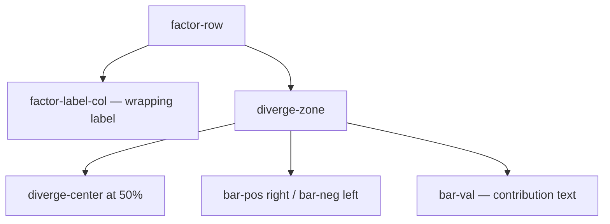

# UI layout — Multiclass Prediction

How the **Multiclass Prediction** component (`multiclassPredictionLwc`) structures the card: **predicted class** (text) and **recommendations** only — no gauge, no numeric KPI panel, no top-drivers section.

---

## Main areas

| Region | Markup / CSS | Notes |
|--------|----------------|-------|
| **Shell** | `.lwc-shell`, header with title + Refresh | Same shell pattern as sibling projects. |
| **Class hero** | `.class-hero-panel` → `.class-hero` → `.class-hero__label`, `.class-hero__caption` | Large **text** label (humanized or raw per App Builder). Empty state shows an em dash. Caption from **Subtitle under predicted class**. |
| **Recommendations** | `.improve-section`, `.factor-row`, `.diverge-zone` | **Diverging** horizontal bars from a vertical center line; **SHAP-style** contribution scores (±x.x, **not** percentages). See below. |
| **Legend** | `.diverge-legend`, `.legend-item`, `.legend-dot` | “Supports prediction” / “Works against”. Dot **background colors** are bound in JS to the same **risk / good** resolution as the bars (including **Recommendations: treat positive % as good**). |
| **AI summary** | `.agent-summary` | Optional; shown when a prompt template Id/API name is set. |

---

## Diverging chart (recommended rows)

Each row (`.factor-row`) is a flex row:

1. **Label column** (`.factor-label-col` → `.factor-label-text`) — Field / value text (`title` attribute carries full string for hover). Text **wraps** (no forced ellipsis); column width is capped with `max-width: min(22rem, 50%)` so the chart keeps space. **`flex: 0 1 auto`** so the column sizes to content up to that cap.
2. **Diverge zone** (`.diverge-zone`) — `flex: 1 1 0`, `min-width: 8.75rem`, fixed vertical slot for bars. Contains:
   - **Center axis** (`.diverge-center`) at 50%.
   - **Positive** values: `.bar-fill.bar-pos` growing **right** from center (`transform: scaleX` animated in JS).
   - **Negative** or zero: `.bar-fill.bar-neg` growing **left** from center.
   - **Value label** (`.bar-val` + `.val-pos` / `.val-neg`): white text with **text-shadow** for contrast on colored fills.

Rows are ordered by **descending absolute** `value` (strongest contributions first). Bar length is proportional to **|value|** within the row set (`barScale`).

### Structure (Mermaid)

---

## Typography and responsiveness

- The shell (`.lwc-shell`) uses **`container-type: inline-size`** so the class label can scale with card width (`clamp` + `cqw`).
- **Narrow card** (`@container (max-width: 420px)`): each `.factor-row` becomes a **column** — label full width, **left-aligned**, then the diverging zone **full width** below (avoids squeezing labels beside the chart).
- **Very narrow** (`@container (max-width: 340px)`): hero and section label typography tighten; diverge center stays centered.

---

## Customization

- **Structural or typographic tweaks:** Edit `multiclassPredictionLwc.css` in this repo and redeploy.
- **Bar colors:** App Builder **Default risk / good color** and optional recommendation overrides; legend dots use the same mapping via `legendSupportsDotStyle` / `legendAgainstDotStyle` in JS.
- **Host CSS hooks:** `--lwc-model-delta-risk` / `--lwc-model-delta-good` on `:host` remain available if you extend the bundle.

---

## Related

- [COMPONENT_REFERENCE.md](COMPONENT_REFERENCE.md) — all App Builder properties
- [ARCHITECTURE.md](ARCHITECTURE.md) — sequence, data flow, recommendation processing diagram
- [FLOW_GUIDE.md](FLOW_GUIDE.md) — JSON shape for recommendations
