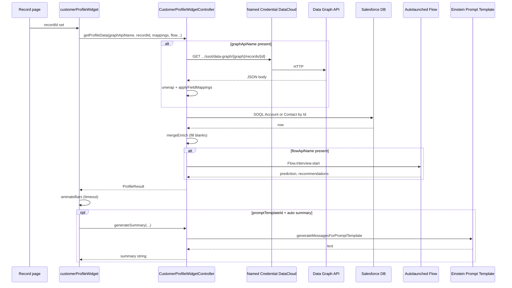
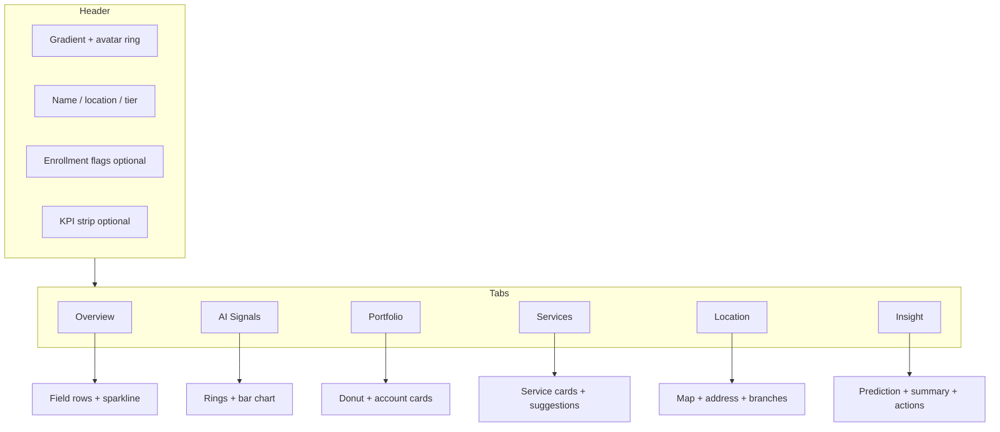

# Architecture — Customer Profile Widget

## High-level behavior

1. The LWC receives **`recordId`** from the record page (or host).
2. On `recordId` set (and in `connectedCallback` if already set), it calls **`CustomerProfileWidgetController.getProfileData`** with:
   - **`graphApiName`** — if blank, step 3 is skipped.
   - **`recordId`**
   - **`fieldMappingsJson`** — JSON map built from every `field*` `@api` property (logical key → dot path).
   - **Flow** parameters — if **`flowApiName`** is blank, Flow merge is skipped.
3. Apex optionally **GETs** the Data Graph record over HTTP (**Named Credential `DataCloud`**), parses JSON, and **maps** values into `ProfileResult` using dot notation paths.
4. Apex always **merges** CRM **SOQL** data for the same `recordId` (Account or Contact) into **empty** profile slots (does not overwrite graph values already set).
5. If **Flow** is configured, Apex runs it and sets **`predictionLabel`** and **`recommendationsJson`** on `ProfileResult` (overwriting any prior values for those two fields when Flow returns data).
6. The LWC binds `ProfileResult` to the UI. After ~400 ms it runs **`animateBars()`** on signal bar fills (CSS transform).
7. If **`promptTemplateId`** is set and **`autoGenerateSummary`** is not explicitly false, the LWC calls **`generateSummary`**, which sends a JSON payload to **Einstein Prompt Template** and displays the returned text on the **Insight** tab.

## Merge semantics

| Source | When | What it fills |
|--------|------|----------------|
| Data Graph | `graphApiName` + successful HTTP | All mapped fields present in JSON |
| SOQL | Always when `recordId` is valid | Only **null/blank** fields on `ProfileResult` after graph step |
| Flow | `flowApiName` set | **predictionLabel**, **recommendationsJson** when outputs exist |

## JSON unwrapping (graph response)

Apex **`unwrapGraphRoot`** treats the deserialized body as:

- If top-level has **`record`** object → use that map as the mapping root.
- Else if top-level has **`data`** object → use that.
- Else → use the top-level map.

Your Data Graph API response must either be a **flat** map of fields or a structure where the fields you care about live under **`record`** or **`data`**, or adjust paths to start at the correct prefix (e.g. `party.individual.firstName`).

## Security

- Controller is **`with sharing`**.
- Graph access is only as strong as the **Named Credential** identity and Data Cloud permissions.
- Users need **Apex authorization** for the controller class.

## UI architecture

## Related docs

- [DATA_GRAPH.md](DATA_GRAPH.md) — how to shape graph JSON and mappings.
- [DIAGRAMS.md](DIAGRAMS.md) — additional Mermaid figures.
- [COMPONENT_REFERENCE.md](COMPONENT_REFERENCE.md) — designer properties.
