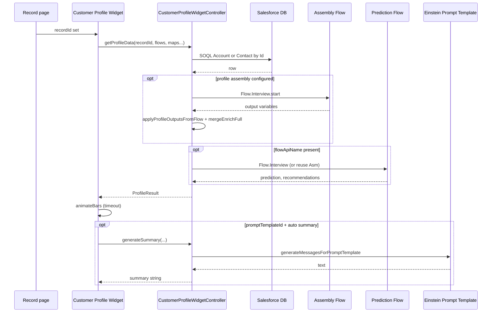
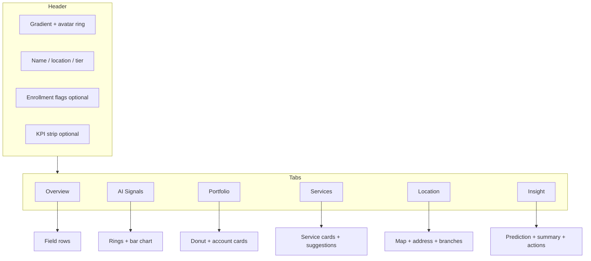

# How the widget works — Customer Profile Widget

This page explains **how data gets to the card** in terms a business reader can follow. Technical names are included where they match App Builder or code.

---

## Plain-language overview

1. User opens an **Account** or **Contact** record. Salesforce tells the widget **which record** it is.  
2. The widget asks the server (**CustomerProfileWidgetController**) for a **profile package** for that record.  
3. The server **reads Salesforce** (standard and optional custom fields).  
4. **If you configured a profile Flow**, the server runs that Flow and **overlays** Flow values on top; **empty** Flow slots can still be filled from Salesforce.  
5. **If you configured an Insight Flow**, the server adds **prediction** and **recommendation** text to that package (or reuses the same Flow run when API names match).  
6. The widget **draws the card**. Short delay, then small **animations** on signal bars.  
7. **If you configured Einstein**, the widget may ask for a **short AI summary** for the Insight tab.

You do **not** send a special “graph JSON” blob for the profile Flow. Each piece of data is a normal Flow **output variable** (text, number, etc.).

---

## Technical walkthrough (numbered)

1. The Lightning component receives **`recordId`** from the record page.  
2. It calls **`CustomerProfileWidgetController.getProfileData`** with your Flow and field settings.  
3. Apex runs **SOQL** (a Salesforce query) for Account or Contact into a baseline **`ProfileResult`**.  
4. If a **profile assembly Flow** is configured with a non-empty output map, Apex runs that **autolaunched** Flow and copies **output variables** into `ProfileResult`, then **fills remaining blanks** from the SOQL layer.  
5. If a **prediction Flow** is configured, Apex merges **prediction** and **recommendations**. If its API name is the **same** as the assembly Flow, **one** Flow run serves both.  
6. The widget renders. After about 400 ms it runs **`animateBars()`** on signal bars.  
7. If **`promptTemplateId`** is set and auto-summary is not turned off, the widget calls **`generateSummary`** (Einstein).

---

## Where each part of the data comes from

| Source | When it runs | What it provides |
|--------|----------------|------------------|
| **Profile assembly Flow** | You set the Flow API name **and** at least one output mapping | Values for mapped slots; Salesforce fills gaps |
| **Salesforce only** | No assembly Flow | Standard + optional custom fields you mapped |
| **Insight / prediction Flow** | You set **Autolaunched flow API name (predictions)** | Headline and recommendations on Insight |

---

## Security (short)

- The controller runs with **user sharing rules** (`with sharing`).  
- Users must have the **Customer_Profile_Widget_User** permission set (Apex access).

---

## Diagram: request sequence

---

## Diagram: screen layout

---

**More diagrams:** [DIAGRAMS.md](DIAGRAMS.md) · **Properties:** [COMPONENT_REFERENCE.md](COMPONENT_REFERENCE.md)
