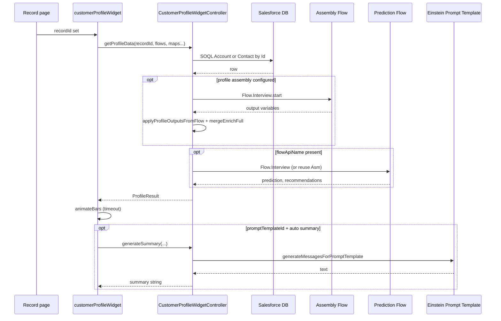
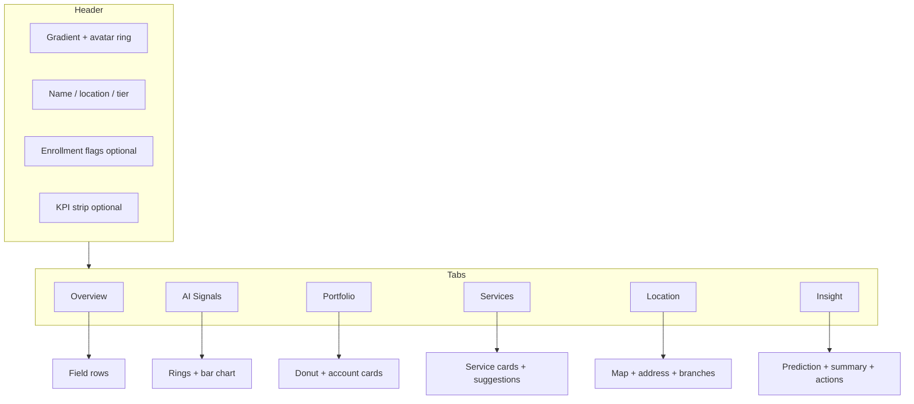

# Architecture — Customer Profile Widget

## High-level behavior

1. The LWC receives **`recordId`** from the record page (or host).
2. On `recordId` set (and in `connectedCallback` if already set), it calls **`CustomerProfileWidgetController.getProfileData`** with assembly Flow settings, prediction Flow settings, and optional **`coreCustomFieldsJson`**.
3. Apex loads **CRM** data with **SOQL** (Account or Contact) into a baseline `ProfileResult`, including optional custom fields from `coreCustomFieldsJson`.
4. If **profile assembly Flow** is configured (`profileAssemblyFlowApiName` + non-empty **`profileFlowOutputMapJson`**), Apex runs that autolaunched Flow and copies **Flow output variables** into `ProfileResult` using the map (logical widget key → output variable API name). Apex then **fills blanks** on that result from the SOQL layer (`mergeEnrichFull`).
5. If **prediction Flow** is configured (`flowApiName`), Apex merges **prediction** and **recommendations** outputs. When the prediction Flow is the **same** API name as the assembly Flow, **one** `Flow.Interview` is reused.
6. The LWC binds `ProfileResult` to the UI. After ~400 ms it runs **`animateBars()`** on signal bar fills (CSS transform).
7. If **`promptTemplateId`** is set and **`autoGenerateSummary`** is not explicitly false, the LWC calls **`generateSummary`** (Einstein Prompt Template) for the **Insight** tab.

**Flow assignments:** You do not pass a graph JSON blob. Each mapped slot is a normal Flow **output** (Text, Number, Currency, Checkbox, etc.). Apex reads values with `Flow.Interview.getVariableValue`. For **`nearbyBranches`**, store a **Text** output containing a JSON array string, or another type Apex can `JSON.serialize` / deserialize.

## Merge semantics

| Source | When | What it fills |
|--------|------|----------------|
| Assembly Flow | `profileAssemblyFlowApiName` + output map | Mapped outputs; SOQL fills **remaining blanks** |
| SOQL only | No assembly Flow | Standard + optional custom CRM fields |
| Prediction Flow | `flowApiName` set | **predictionLabel**, **recommendationsJson** when outputs exist |

## Security

- Controller is **`with sharing`**.
- Users need **Apex authorization** for the controller class.

## UI architecture

## Related docs

- [DIAGRAMS.md](DIAGRAMS.md) — additional Mermaid figures.
- [COMPONENT_REFERENCE.md](COMPONENT_REFERENCE.md) — designer properties.
