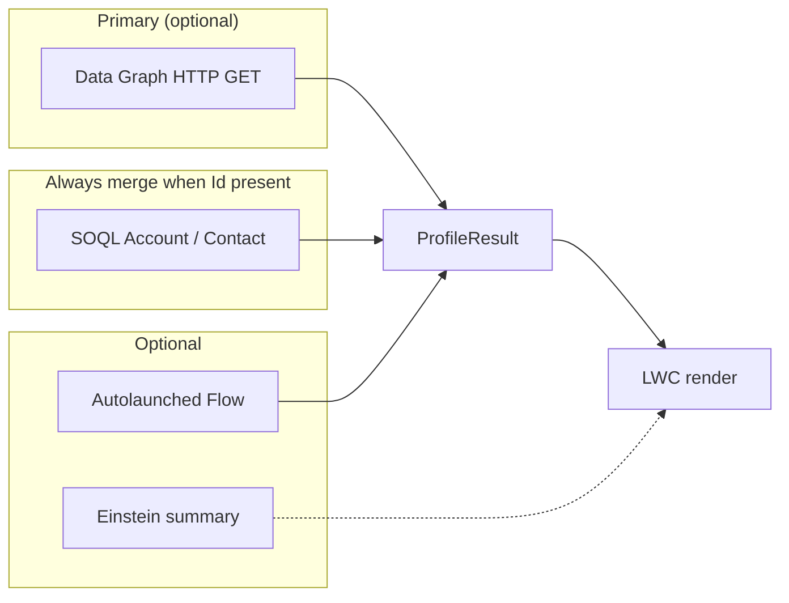
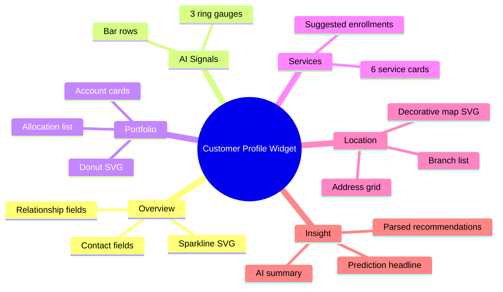
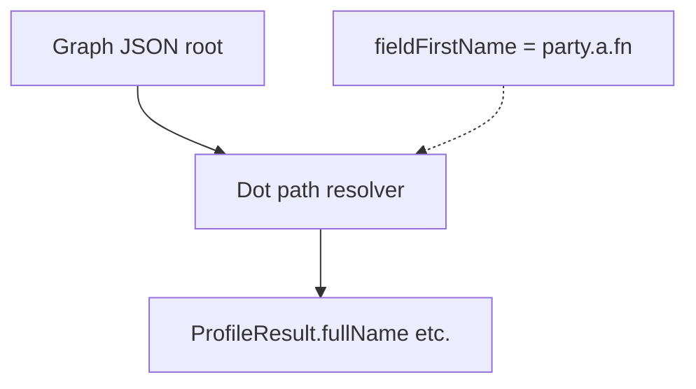
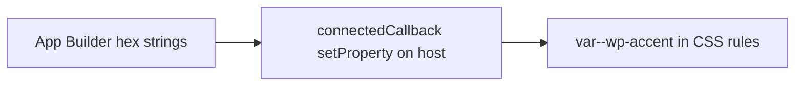

# Diagrams — Customer Profile Widget

Mermaid diagrams for reviews, Confluence, or GitHub rendering.

## 1. Data sourcing layers

## 2. Tab content map

## 3. Field mapping concept

## 4. Theming (CSS variables)

---

Also see the **sequence diagram** in [ARCHITECTURE.md](ARCHITECTURE.md).
