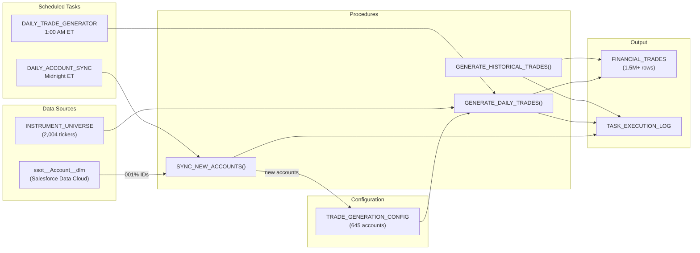

# Financial Trades Generation System

<div align="center">

[](https://www.snowflake.com/)
[](https://www.python.org/)
[](https://docs.snowflake.com/en/developer-guide/snowpark/python/index)
[](https://developer.salesforce.com/docs/data/data-cloud-query-guide/guide/query-guide-get-started.html)

[](https://docs.snowflake.com/en/user-guide/tasks-intro)
[](schemas/financial_trades.sql)
[](schemas/trade_generation_config.sql)
[](schemas/instrument_universe.sql)

[](https://github.com/josers18/JDO)

**Snowflake-native** · **Automated pipeline** · **Synthetic trade data**

</div>

A Snowflake-native automated trade generation pipeline that produces realistic synthetic financial trade data for 645 accounts across 2,004 instruments, with configurable frequency, risk profiles, and volume controls.

## Data at a Glance

| Metric | Value |
|---|---|
| Total trades | 1,531,879 |
| Active accounts | 645 |
| Instrument universe | 2,004 tickers |
| Date range | June 2024 -- present |
| Trading days covered | 489 |
| Avg trade value | $95,226 |
| Price range | $8.65 -- $802.69 |

## Architecture



## Daily Pipeline Schedule

| Time (ET) | Task | Procedure | Purpose |
|---|---|---|---|
| 12:00 AM | `DAILY_ACCOUNT_SYNC` | `SYNC_NEW_ACCOUNTS()` | Check for new org accounts, add to config |
| 1:00 AM | `DAILY_TRADE_GENERATOR` | `GENERATE_DAILY_TRADES()` | Generate trades for all active accounts |

The 1-hour gap ensures newly synced accounts are available before trade generation runs.

## Database Objects

### Tables

| Table | Rows | Purpose |
|---|---|---|
| [`FINANCIAL_TRADES`](schemas/financial_trades.sql) | 1,531,879 | Primary output -- all generated trades (25 columns) |
| [`TRADE_GENERATION_CONFIG`](schemas/trade_generation_config.sql) | 645 | Per-account generation settings (frequency, risk, volume) |
| [`INSTRUMENT_UNIVERSE`](schemas/instrument_universe.sql) | 2,004 | Reference table of tradeable instruments |
| [`TASK_EXECUTION_LOG`](schemas/task_execution_log.sql) | 53+ | Execution audit trail for all procedures |

### Stored Procedures

| Procedure | Purpose |
|---|---|
| [`GENERATE_DAILY_TRADES()`](procedures/generate_daily_trades.sql) | Generate today's trades for all due accounts |
| [`SYNC_NEW_ACCOUNTS()`](procedures/sync_new_accounts.sql) | Import new org accounts from Salesforce Data Cloud |
| [`GENERATE_HISTORICAL_TRADES(START_DATE, END_DATE)`](procedures/generate_historical_trades.sql) | Backfill trades for a date range |

### Scheduled Tasks

| Task | Schedule | Definition |
|---|---|---|
| [`DAILY_ACCOUNT_SYNC`](tasks/daily_account_sync.sql) | Midnight ET daily | `CALL SYNC_NEW_ACCOUNTS()` |
| [`DAILY_TRADE_GENERATOR`](tasks/daily_trade_generator.sql) | 1:00 AM ET daily | `CALL GENERATE_DAILY_TRADES()` |

## Account Configuration

Accounts are sourced from the Salesforce Data Cloud shared table `FINSDC3_DATASHARE."schema_Jedi_Snowflake"."ssot__Account__dlm"` and mapped by type:

| Source Type | Account Type | Frequency | Trades/Period | Risk Profile | Max Trade Value |
|---|---|---|---|---|---|
| Enterprise | Institutional | DAILY | 12 | Moderate | $500,000 |
| Mid-Market | Institutional | DAILY | 8 | Moderate | $300,000 |
| Small Business | Retail | WEEKLY | 4 | Conservative | $100,000 |
| Client | Retail | DAILY | 6 | Moderate | $200,000 |
| Person | Retail | MONTHLY | 3 | Conservative | $50,000 |
| Partner | Institutional | WEEKLY | 10 | Aggressive | $400,000 |
| Investor | Institutional | DAILY | 15 | Aggressive | $750,000 |
| Consultant | Retail | MONTHLY | 2 | Conservative | $75,000 |
| Other/NULL | Retail | WEEKLY | 5 | Moderate | $150,000 |

## Instrument Universe

2,004 instruments across 8 sectors:

| Sector | Count |
|---|---|
| General | 1,358 |
| Financials | 264 |
| Energy | 152 |
| Technology | 75 |
| Healthcare | 53 |
| Consumer | 53 |
| Industrials | 32 |
| Communication | 17 |

## Quick Start

```sql
-- Generate today's trades
CALL FINS.PUBLIC.GENERATE_DAILY_TRADES();

-- Sync new accounts from org
CALL FINS.PUBLIC.SYNC_NEW_ACCOUNTS();

-- Backfill historical trades for a date range
CALL FINS.PUBLIC.GENERATE_HISTORICAL_TRADES('2024-06-01'::DATE, '2024-12-31'::DATE);

-- Check execution history
SELECT * FROM FINS.PUBLIC.TASK_EXECUTION_LOG ORDER BY EXECUTION_TIME DESC LIMIT 10;

-- Verify task schedules
SHOW TASKS IN SCHEMA FINS.PUBLIC;
```

## Detailed Documentation

- [Architecture and Data Flow](docs/architecture.md) -- System design, ER diagrams, data flow
- [Trade Generation Logic](docs/trade_generation_logic.md) -- Algorithm deep dive: pricing, risk, frequency gating
- [Account Sync Pipeline](docs/account_sync.md) -- Salesforce Data Cloud integration, type mapping
- [Historical Backfill Guide](docs/historical_backfill.md) -- Backfilling trades, chunking strategy, volume estimates

## Snowflake Environment

| Setting | Value |
|---|---|
| Database | `FINS` |
| Schema | `PUBLIC` |
| Task Warehouse | `TASK_WH` (X-Small) |
| Backfill Warehouse | `LARGE_LOAD` (X-Large, recommended) |
| Role | `SYSADMIN` |
| Source Database | `FINSDC3_DATASHARE` (shared/secure) |
