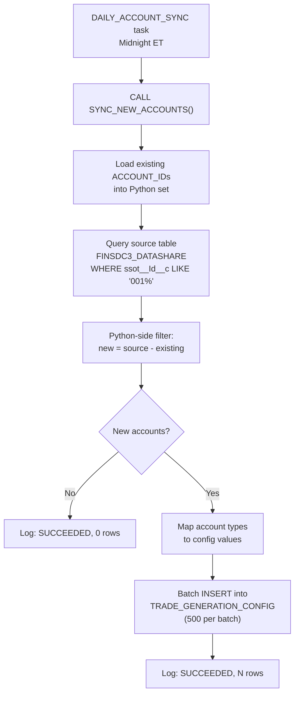

# Account Sync Pipeline

## Overview

The account sync pipeline imports new accounts from a Salesforce Data Cloud shared table into the local `TRADE_GENERATION_CONFIG` table. It runs daily at midnight ET via the `DAILY_ACCOUNT_SYNC` task.

## Source Data

| Property | Value |
|---|---|
| Database | `FINSDC3_DATASHARE` (shared/secure) |
| Schema | `"schema_Jedi_Snowflake"` (mixed-case, must be double-quoted) |
| Table | `"ssot__Account__dlm"` (all column names must be double-quoted) |

### Source Columns Used

| Source Column | Maps To | Notes |
|---|---|---|
| `"ssot__Id__c"` | `ACCOUNT_ID` | Filtered to `001%` pattern |
| `"ssot__Name__c"` | `ACCOUNT_NAME` | Must be non-null and non-blank |
| `"ssot__AccountTypeId__c"` | Mapped to multiple config columns | See type mapping below |

## Account Type Mapping

The source `AccountTypeId` is mapped to five configuration columns:

| Source Type | Account Type | Frequency | Trades/Period | Risk Profile | Max Trade Value |
|---|---|---|---|---|---|
| Enterprise | Institutional | DAILY | 12 | Moderate | $500,000 |
| Mid-Market | Institutional | DAILY | 8 | Moderate | $300,000 |
| Small Business | Retail | WEEKLY | 4 | Conservative | $100,000 |
| Client | Retail | DAILY | 6 | Moderate | $200,000 |
| Person | Retail | MONTHLY | 3 | Conservative | $50,000 |
| Partner | Institutional | WEEKLY | 10 | Aggressive | $400,000 |
| Investor | Institutional | DAILY | 15 | Aggressive | $750,000 |
| Consultant | Retail | MONTHLY | 2 | Conservative | $75,000 |
| Other/NULL | Retail | WEEKLY | 5 | Moderate | $150,000 |

## Pipeline Flow



## Secure Object Limitations

The source table is a shared/secure object from Salesforce Data Cloud. This imposes several restrictions:

| Limitation | Workaround |
|---|---|
| `COUNT(*)` with `WHERE` clause fails | Load all rows into Python, filter client-side |
| `CTAS` with `TRIM()` fails | Avoid CTAS; use direct INSERT |
| `INSERT ... SELECT` with subqueries fails | Collect rows into Python, then batch INSERT with parameters |
| Mixed-case schema/column names | Always double-quote: `"schema_Jedi_Snowflake"`, `"ssot__Id__c"` |

## Implementation Details

- **Duplicate prevention**: Existing account IDs are loaded into a Python `set` before querying the source. New accounts are identified by set difference, not by SQL anti-join (which would fail on the secure object).
- **Batch size**: 500 rows per INSERT to stay within Snowflake parameter limits.
- **Notes field**: All imported accounts are tagged with `"Auto-imported from ssot__Account__dlm"`.
- **ACTIVE flag**: All new accounts default to `TRUE`.
- **LAST_GENERATED_DATE**: Left as `NULL` for new accounts -- the trade generator will treat them as due on its first run.

## Current Account Distribution

| Source | Count | ID Pattern |
|---|---|---|
| Original manual accounts | 5 | `TRD-xxx` |
| Imported from org | 640 | `001%` |
| **Total** | **645** | |

## Execution Logging

Every sync execution writes to `TASK_EXECUTION_LOG`:

```sql
-- Check recent sync results
SELECT TASK_NAME, STATUS, ROWS_INSERTED, ACCOUNTS_PROCESSED, ERROR_MESSAGE, DURATION_MS
FROM FINS.PUBLIC.TASK_EXECUTION_LOG
WHERE TASK_NAME = 'ACCOUNT_SYNC'
ORDER BY EXECUTION_TIME DESC
LIMIT 10;
```
