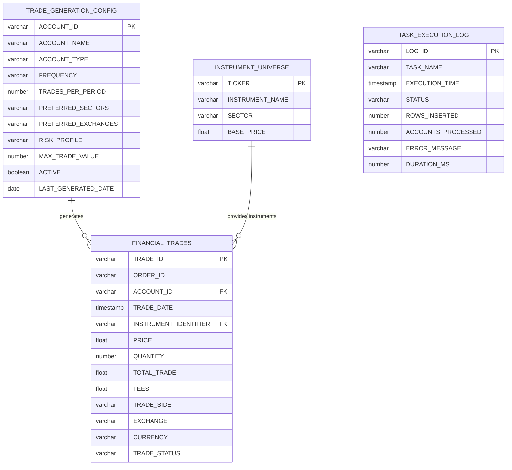
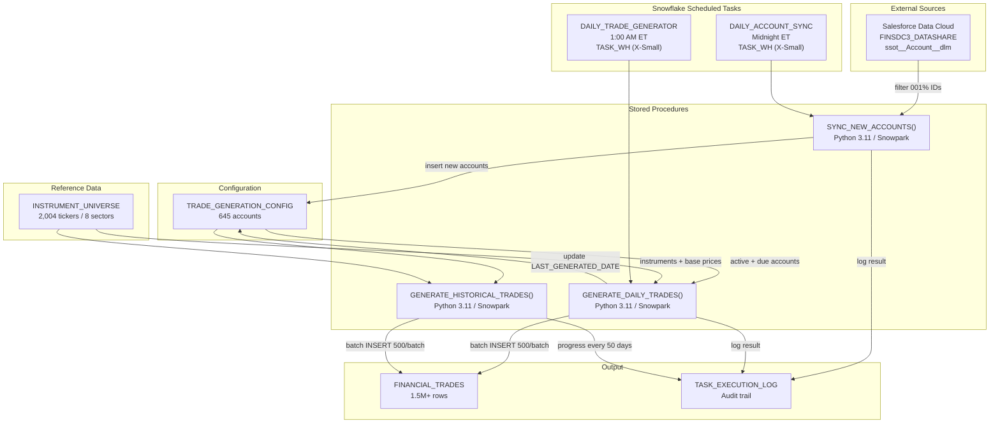
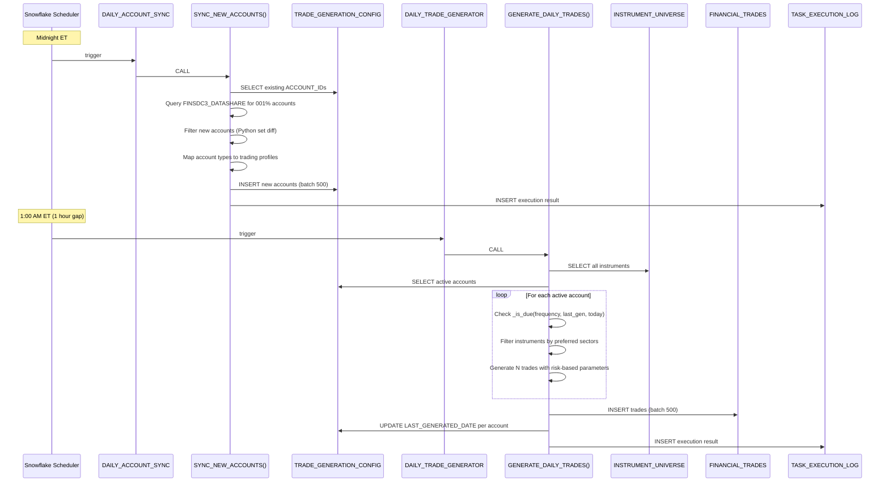

# Architecture and Data Flow

## System Overview

The Financial Trades Generation system is a Snowflake-native data pipeline that produces realistic synthetic trade data. It runs entirely within Snowflake using scheduled tasks, Python stored procedures (Snowpark), and reference/configuration tables.

## Entity Relationship Diagram

## Data Flow Diagram

## Daily Pipeline Sequence

## Warehouse Strategy

| Warehouse | Size | Purpose | Used By |
|---|---|---|---|
| `TASK_WH` | X-Small | Daily automated operations | `DAILY_ACCOUNT_SYNC`, `DAILY_TRADE_GENERATOR` |
| `LARGE_LOAD` | X-Large | Bulk historical backfill | `GENERATE_HISTORICAL_TRADES()` (manual) |

The daily tasks run on X-Small since they process a single day's trades (~3,100 per run). Historical backfill requires X-Large to handle hundreds of days and millions of rows without timeouts.

## Key Design Decisions

1. **Python Snowpark over SQL**: Trade generation requires complex randomization (weighted choices, jitter, UUID generation) that is more naturally expressed in Python than SQL.

2. **EXECUTE AS OWNER**: Procedures run with owner privileges to access shared database objects. This introduces a limitation: temporary tables cannot be created inside these procedures.

3. **Batch INSERT pattern**: Trades are accumulated in Python lists and inserted in batches of 500 using parameterized `INSERT INTO ... VALUES` statements. This avoids DataFrame overhead and provides predictable performance.

4. **Frequency gating in Python**: The `_is_due()` function runs client-side (in the procedure) rather than as a SQL filter, because the logic depends on per-account state that evolves as the procedure iterates through days.

5. **1-hour task gap**: Account sync at midnight, trade generation at 1 AM. This ensures newly imported accounts are committed and visible before the generator reads them.

6. **Resume capability**: The historical backfill procedure reads existing trades from `FINANCIAL_TRADES` to initialize the `last_gen` dict, allowing it to resume correctly across chunked executions without duplicating WEEKLY/MONTHLY triggers.
