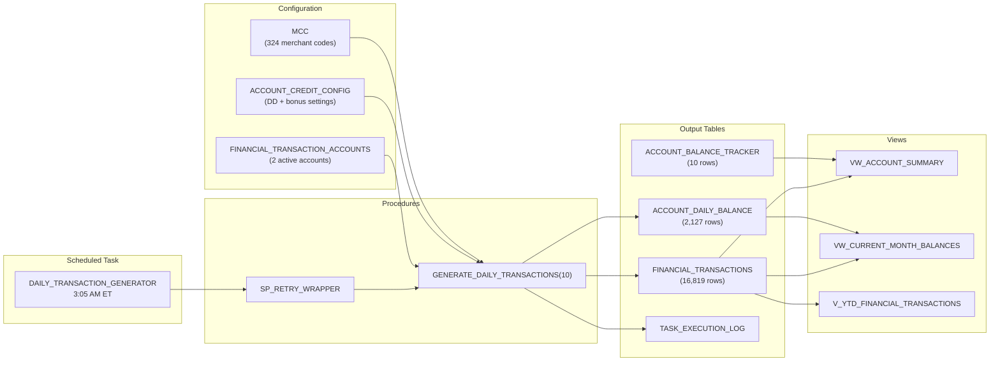

# Financial Transactions Generation System

<div align="center">

[](https://www.snowflake.com/)
[](https://www.python.org/)
[](https://docs.snowflake.com/en/developer-guide/snowpark/python/index)

[](https://docs.snowflake.com/en/user-guide/tasks-intro)
[](schemas/financial_transactions.sql)
[](schemas/financial_transaction_accounts.sql)
[](schemas/mcc.sql)

[](https://github.com/josers18/JDO)

**Snowflake-native** · **Automated pipeline** · **Synthetic transaction data**

</div>

A Snowflake-native automated transaction generation pipeline that produces realistic synthetic bank transactions (debits and credits) for active accounts, using MCC-based merchant categorization with category-aware amount ranges.

## Data at a Glance

| Metric | Value |
|---|---|
| Total transactions | 16,819 |
| Active accounts | 2 (1 Personal, 1 Business) |
| MCC codes | 324 |
| Credits | Direct deposits (bi-monthly) + quarterly bonuses |
| Debits | MCC-categorized purchases, category-aware amounts |
| Balance tracking | Daily + monthly aggregation |

## Architecture



## Daily Pipeline Schedule

| Time (ET) | Task | Procedure | Purpose |
|---|---|---|---|
| 3:05 AM | `DAILY_TRANSACTION_GENERATOR` | `GENERATE_DAILY_TRANSACTIONS(10)` | Generate ~10 transactions per active account |

The task runs through `SP_RETRY_WRAPPER` with 2 retries. It is idempotent — if transactions already exist for today, it skips execution.

## Database Objects

### Tables

| Table | Rows | Purpose |
|---|---|---|
| [`FINANCIAL_TRANSACTIONS`](schemas/financial_transactions.sql) | 16,819 | Primary output — all generated transactions (17 columns) |
| [`FINANCIAL_TRANSACTION_ACCOUNTS`](schemas/financial_transaction_accounts.sql) | 2 | Active accounts for transaction generation |
| [`ACCOUNT_CREDIT_CONFIG`](schemas/account_credit_config.sql) | 2 | Direct deposit amounts, bonus config, DD days |
| [`ACCOUNT_BALANCE_TRACKER`](schemas/account_balance_tracker.sql) | 10 | Monthly balance aggregation per account |
| [`ACCOUNT_DAILY_BALANCE`](schemas/account_daily_balance.sql) | 2,127 | Daily balance snapshots (rebuilt each run) |
| [`MCC`](schemas/mcc.sql) | 324 | Merchant Category Codes reference |

### Views

| View | Purpose |
|---|---|
| [`VW_ACCOUNT_SUMMARY`](views/vw_account_summary.sql) | Lifetime summary stats for all active accounts |
| [`VW_CURRENT_MONTH_BALANCES`](views/vw_current_month_balances.sql) | Current month balance with status flags (GOOD_STANDING, HIGH_UTILIZATION, etc.) |
| [`V_YTD_FINANCIAL_TRANSACTIONS`](views/v_ytd_financial_transactions.sql) | Year-to-date transaction filter |

### Stored Procedures

| Procedure | Purpose |
|---|---|
| [`GENERATE_DAILY_TRANSACTIONS(n)`](procedures/generate_daily_transactions.sql) | Generate n transactions per account for today |
| [`GENERATE_DAILY_TRANSACTIONS_DEBUG(n)`](procedures/generate_daily_transactions_debug.sql) | Verbose debug version with step-by-step output |

### Scheduled Tasks

| Task | Schedule | Definition |
|---|---|---|
| [`DAILY_TRANSACTION_GENERATOR`](tasks/daily_transaction_generator.sql) | 3:05 AM ET daily | `CALL SP_RETRY_WRAPPER('GENERATE_DAILY_TRANSACTIONS(10)', 2)` |
| WEEKLY_BALANCE_REPORT | 3:10 AM ET Mondays | `SELECT * FROM VW_ACCOUNT_SUMMARY` |

## Account Configuration

| Account ID | SF Account ID | Type | Direct Deposit | Bonus | Active |
|---|---|---|---|---|---|
| CC-123456789 | 001am00000qvjsAAAQ | Personal | $9,340.54 | $12,700.00 | Yes |
| BC-4421335 | 001am00000qvjs6AAA | Business | $36,500.00 | $18,000.00 | Yes |

### Credit Schedule

| Event | Trigger | Accounts |
|---|---|---|
| Direct Deposit | Day 15 of each month | All active |
| Quarterly Bonus | Day 1 of Jan, Apr, Jul, Oct | All active |

## Quick Start

```sql
-- Generate today's transactions (10 per account)
CALL DATA_JEDAIS.FINS__PUBLIC.GENERATE_DAILY_TRANSACTIONS(10);

-- Debug version with verbose output
CALL DATA_JEDAIS.FINS__PUBLIC.GENERATE_DAILY_TRANSACTIONS_DEBUG(5);

-- Check execution history
SELECT * FROM DATA_JEDAIS.FINS__PUBLIC.TASK_EXECUTION_LOG
WHERE TASK_NAME = 'DAILY_TRANSACTION_GENERATOR'
ORDER BY EXECUTION_TIME DESC LIMIT 10;

-- Account summary
SELECT * FROM DATA_JEDAIS.FINS__PUBLIC.VW_ACCOUNT_SUMMARY;

-- Current month balances with status
SELECT * FROM DATA_JEDAIS.FINS__PUBLIC.VW_CURRENT_MONTH_BALANCES;

-- YTD transactions
SELECT * FROM DATA_JEDAIS.FINS__PUBLIC.V_YTD_FINANCIAL_TRANSACTIONS LIMIT 100;
```

## Detailed Documentation

- [Architecture and Data Flow](docs/architecture.md) — ER diagrams, data flow, balance rebuild logic
- [Transaction Generation Logic](docs/transaction_generation_logic.md) — MCC selection, amount ranges, credit/debit logic

## Snowflake Environment

| Setting | Value |
|---|---|
| Database | `DATA_JEDAIS` |
| Schema | `FINS__PUBLIC` |
| Task Warehouse | `TASK_WH` (X-Small) |
| Role | `SYSADMIN` |
