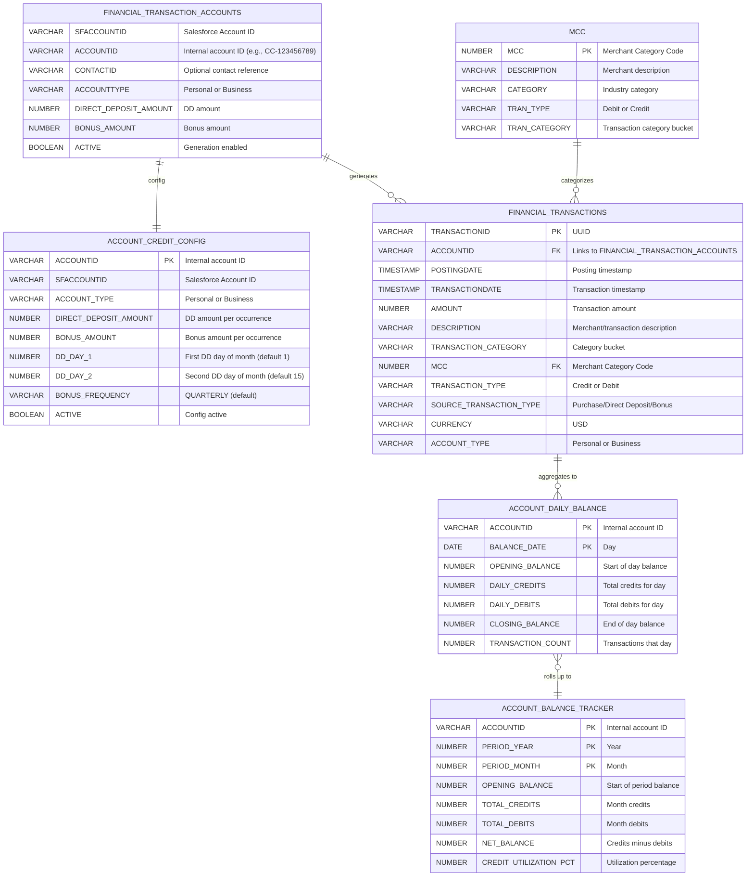
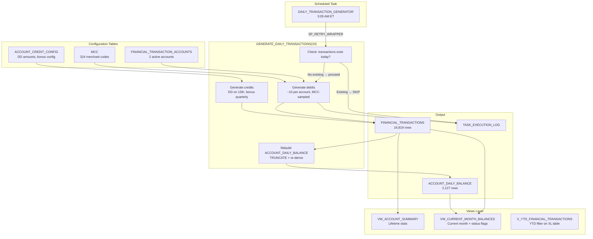
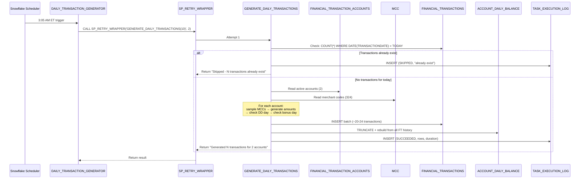

# Architecture

Detailed architecture of the Financial Transactions Generation pipeline in `DATA_JEDAIS.FINS__PUBLIC`.

---

## Entity Relationship Diagram

---

## Data Flow

---

## Execution Sequence

---

## Balance Rebuild Logic

After every successful transaction generation, the SP rebuilds `ACCOUNT_DAILY_BALANCE`:

1. **TRUNCATE** the table (destructive but deterministic)
2. **Re-derive** from all `FINANCIAL_TRANSACTIONS` using a window function:
   - Group by ACCOUNTID + DATE(TRANSACTIONDATE)
   - Calculate DAILY_CREDITS, DAILY_DEBITS, TRANSACTION_COUNT
   - Compute OPENING_BALANCE as cumulative sum of prior days
   - Compute CLOSING_BALANCE as cumulative sum including current day

This ensures the daily balance table is always consistent with the transaction history, even if transactions are manually inserted or deleted.

---

## Views

| View | Source | Purpose |
|------|--------|---------|
| VW_ACCOUNT_SUMMARY | ACCOUNT_CREDIT_CONFIG + ACCOUNT_BALANCE_TRACKER | Lifetime credits, debits, balance, utilization per account |
| VW_CURRENT_MONTH_BALANCES | ACCOUNT_BALANCE_TRACKER + ACCOUNT_CREDIT_CONFIG | Current month with ACCOUNT_STATUS flag (GOOD_STANDING, HIGH_UTILIZATION, OVERDRAWN) |
| V_YTD_FINANCIAL_TRANSACTIONS | FINANCIAL_TRANSACTIONS_XL | YTD filter on the large 100M-row demo table (NOT the daily-generated table) |
