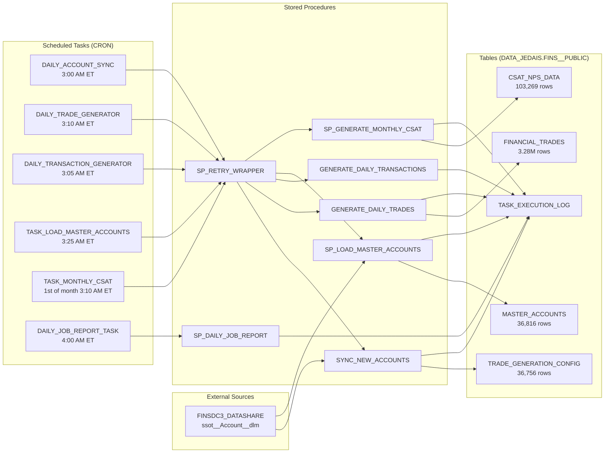

# Snowflake Data Pipelines

<div align="center">

[](https://app.snowflake.com)
[](procedures/)
[](procedures/)
[](docs/ARCHITECTURE.md)
[](docs/PROCESSES.md)
[](../Financial_Trades_Generation/README.md)
[](../Snowflake_CSAT_NPS/README.md)
[](https://github.com/josers18/JDO)

<br/>

**Snowflake-native** · **Automated pipelines** · **DATA_JEDAIS.FINS__PUBLIC** · **Daily + Monthly cadence**

</div>

---

## Overview

Centralized documentation for the **Snowflake data infrastructure** powering the JDO demo org. Two independent pipelines run against a shared `DATA_JEDAIS.FINS__PUBLIC` schema, fed by a Salesforce Data Cloud inbound datashare (`FINSDC3_DATASHARE`):

1. **Financial Trades Generation** — daily synthetic trade generation (~5K trades/day) across 2,004 instruments for 36,816 accounts
2. **CSAT/NPS Score Generation** — monthly customer satisfaction + NPS scores for all accounts with archetype-based trajectories

Both share a **retry wrapper**, **execution logging**, and **daily email reporting** infrastructure.

---

## Architecture



---

## Pipelines at a Glance

| Pipeline | Cadence | Procedure | Target Table | Rows | Warehouse |
|----------|---------|-----------|--------------|------|-----------|
| Account Sync (Trades) | Daily 3:00 AM ET | `SYNC_NEW_ACCOUNTS()` | TRADE_GENERATION_CONFIG | 36,756 | TASK_WH (XS) |
| Trade Generation | Daily 3:10 AM ET | `GENERATE_DAILY_TRADES()` | FINANCIAL_TRADES | 3,279,536 | LARGE_LOAD (XL) |
| Transaction Generation | Daily 3:05 AM ET | `GENERATE_DAILY_TRANSACTIONS(10)` | FINANCIAL_TRANSACTIONS | 16,819 | TASK_WH (XS) |
| Master Accounts Sync | Daily 3:25 AM ET | `SP_LOAD_MASTER_ACCOUNTS()` | MASTER_ACCOUNTS | 36,816 | MAIN_WH_XS |
| CSAT/NPS Generation | 1st of month 3:10 AM ET | `SP_GENERATE_MONTHLY_CSAT()` | CSAT_NPS_DATA | 103,269 | MAIN_WH_XS |
| Daily Job Report | Daily 4:00 AM ET | `SP_DAILY_JOB_REPORT()` | (email) | — | TASK_WH (XS) |

---

## Shared Infrastructure

| Component | Type | Purpose |
|-----------|------|---------|
| `SP_RETRY_WRAPPER(sp_call, max_retries)` | Snowpark Python procedure | Exponential backoff retry (30s → 60s). All tasks call their SP through this wrapper. |
| `TASK_EXECUTION_LOG` | Table | Centralized execution history (status, rows, duration, errors) |
| `SP_DAILY_JOB_REPORT()` | Snowpark Python procedure | HTML email summary of all task executions, sent daily at 4 AM ET |
| `TASK_EMAIL_ALERTS` | Notification Integration | Outbound email for daily reports |
| `TASK_ERROR_NOTIFICATIONS` | Notification Integration | Outbound email for error alerts |

---

## Quick Start

```sql
-- Check pipeline health
SELECT TASK_NAME, STATUS, ROWS_INSERTED, DURATION_MS, EXECUTION_TIME
FROM DATA_JEDAIS.FINS__PUBLIC.TASK_EXECUTION_LOG
ORDER BY EXECUTION_TIME DESC
LIMIT 20;

-- Verify active tasks
SHOW TASKS IN SCHEMA DATA_JEDAIS.FINS__PUBLIC;

-- Manual pipeline execution (wraps with retry)
CALL DATA_JEDAIS.FINS__PUBLIC.SP_RETRY_WRAPPER('DATA_JEDAIS.FINS__PUBLIC.SP_LOAD_MASTER_ACCOUNTS()', 2);
CALL DATA_JEDAIS.FINS__PUBLIC.SP_RETRY_WRAPPER('DATA_JEDAIS.FINS__PUBLIC.GENERATE_DAILY_TRADES()', 2);

-- Direct execution (no retry)
CALL DATA_JEDAIS.FINS__PUBLIC.SP_LOAD_MASTER_ACCOUNTS();
CALL DATA_JEDAIS.FINS__PUBLIC.SP_GENERATE_MONTHLY_CSAT();

-- Send job report manually
CALL DATA_JEDAIS.FINS__PUBLIC.SP_DAILY_JOB_REPORT();
```

---

## Documentation

| Document | Description |
|----------|-------------|
| [docs/ARCHITECTURE.md](docs/ARCHITECTURE.md) | ER diagrams, data flow, sequence diagrams, design decisions |
| [docs/PROCESSES.md](docs/PROCESSES.md) | Operational runbook: schedules, monitoring, deployment, error handling |
| [docs/ARTIFACTS.md](docs/ARTIFACTS.md) | Complete inventory of all DATA_JEDAIS.FINS__PUBLIC database objects |
| [docs/DIAGRAMS.md](docs/DIAGRAMS.md) | Consolidated Mermaid diagram reference |
| [docs/ENVIRONMENT.md](docs/ENVIRONMENT.md) | Snowflake connection, warehouses, permissions, external sources |

---

## Related Projects

| Project | Description | Docs |
|---------|-------------|------|
| [Snowflake_Cumulus_Common](../Snowflake_Cumulus_Common/README.md) | Shared `V_ACCOUNT_ANCHORS` view, anchor fixture, and Python helpers for the 13 forthcoming Cumulus dataset pipelines (Plans 1–13). DC ingests each per-dataset table via the existing "Snowflake (Federate / Zero Copy)" connector. | [AGENTS.md](../Snowflake_Cumulus_Common/AGENTS.md) |
| [Financial_Trades_Generation](../Financial_Trades_Generation/README.md) | Daily synthetic trade generation (Snowpark Python + SQL) | [AGENTS.md](../Financial_Trades_Generation/AGENTS.md) |
| [Snowflake_CSAT_NPS](../Snowflake_CSAT_NPS/README.md) | Monthly CSAT/NPS score generation (pure SQL) | [AGENTS.md](../Snowflake_CSAT_NPS/AGENTS.md) |
| [Customer_Hydration](../Customer_Hydration/README.md) | Upstream: seeds Salesforce CRM accounts that flow into Data Cloud | [AGENTS.md](../Customer_Hydration/AGENTS.md) |

---

## Snowflake Environment

| Setting | Value |
|---------|-------|
| Account | SKJADZG-SFDC_DC_TECH_ARCH |
| Database | DATA_JEDAIS |
| Schema | FINS__PUBLIC |
| Role | SYSADMIN |
| User | JOSE |
| Default Warehouse | MAIN_WH_XS (X-Small) |
| Compute Warehouse | LARGE_LOAD (X-Large) — trades only |
| Task Warehouse | TASK_WH (X-Small) |
| External Source | FINSDC3_DATASHARE (Salesforce Data Cloud inbound share) |
| Email Recipient | jsifontes@salesforce.com |
