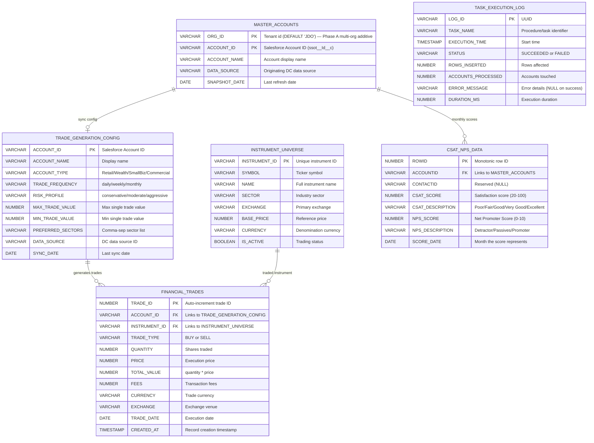
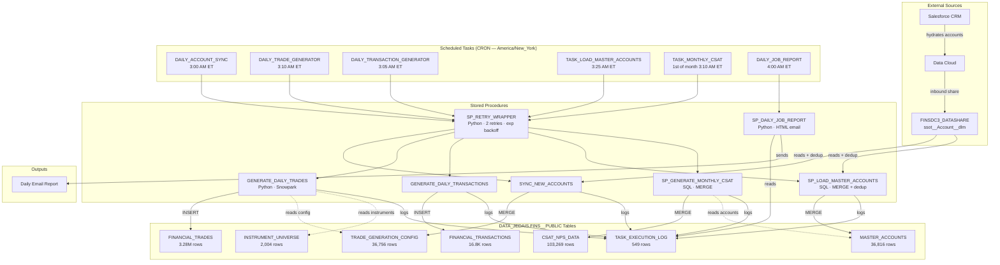
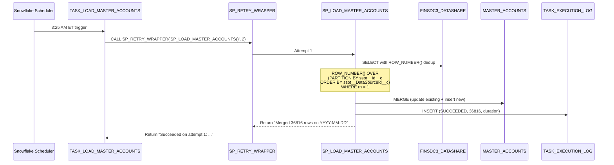
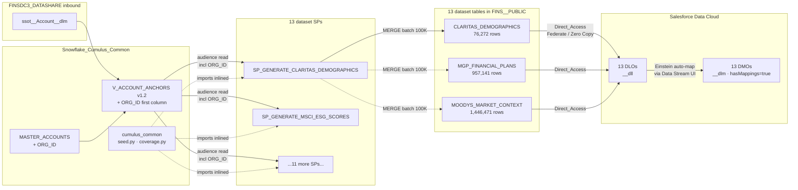

# Architecture

Detailed architecture of the Snowflake data pipelines in `DATA_JEDAIS.FINS__PUBLIC`.

> **Cumulus dataset family** (13 SPs, ~6.4M rows live as of 2026-07-07) is documented separately. See [`../../Snowflake_Cumulus_Common/AGENTS.md`](../../Snowflake_Cumulus_Common/AGENTS.md) and the multi-org rollout runbook at [`../../Snowflake_Cumulus_Common/docs/ROLLOUT.md`](../../Snowflake_Cumulus_Common/docs/ROLLOUT.md).
>
> **Phase A multi-org migration** (commit `c9119d32`, 2026-05-29) added `ORG_ID VARCHAR(18) NOT NULL DEFAULT 'JDO'` as the leading column on `MASTER_ACCOUNTS` and the 13 Cumulus dataset tables. `V_ACCOUNT_ANCHORS` is now v1.2 and exposes `ORG_ID` as its first column. PKs were promoted to lead with `ORG_ID`. JDO existing loaders continue working unchanged via the DEFAULT backstop.

---

## Entity Relationship Diagram



---

## Data Flow



---

## Daily Pipeline Sequence


---

## Master Accounts Sync Sequence



---

## Warehouse Strategy

| Warehouse | Size | Auto-Suspend | Purpose | Tasks |
|-----------|------|--------------|---------|-------|
| MAIN_WH_XS | X-Small | 60s | Cumulus data generation SPs; lightweight queries | TASK_LOAD_MASTER_ACCOUNTS, TASK_MONTHLY_CSAT, Cumulus daily/weekly/monthly |
| TASK_WH | X-Small | 60s | General task execution | DAILY_ACCOUNT_SYNC, DAILY_TRANSACTION_GENERATOR, DAILY_JOB_REPORT_TASK, ENROLLMENTS_SNAPSHOT_TASK, WEEKLY_BALANCE_REPORT |
| LARGE_LOAD | X-Large | 60s | Heavy compute (trade gen) | DAILY_TRADE_GENERATOR |

---

## Retry Strategy (SP_RETRY_WRAPPER)

All scheduled tasks invoke their target procedure through `SP_RETRY_WRAPPER`:

```sql
CALL DATA_JEDAIS.FINS__PUBLIC.SP_RETRY_WRAPPER('DATA_JEDAIS.FINS__PUBLIC.GENERATE_DAILY_TRADES()', 2);
```

| Attempt | Wait Before | Action |
|---------|-------------|--------|
| 1 | — | Execute procedure |
| 2 | 30 seconds | Retry on exception |
| 3 | 60 seconds | Retry on exception |
| — | — | Log `FAILED_ALL_RETRIES` to TASK_EXECUTION_LOG, then RAISE |

The wrapper is **Snowpark Python** (`EXECUTE AS OWNER`) so it can call arbitrary procedures by name and catch Snowflake exceptions generically.

---

## Key Design Decisions

| Decision | Rationale |
|----------|-----------|
| **MERGE + ROW_NUMBER dedup** on account sync | Data Cloud `ssot__Account__dlm` contains duplicate rows per account from multi-source ingestion. ROW_NUMBER collapses duplicates before MERGE prevents "Duplicate row detected" errors. |
| **HASH-based pseudo-randomness** (not RANDOM()) | Deterministic: `HASH(ACCOUNT_ID \|\| date)` produces the same score/trade for the same inputs. Enables reproducibility and debugging without seed management. |
| **Retry wrapper as shared utility** | Transient failures (warehouse contention, datashare latency) are common in scheduled pipelines. Centralized retry with exponential backoff avoids duplicating logic across procedures. |
| **Single TASK_EXECUTION_LOG** for all pipelines | Unified monitoring, alerting, and daily reporting. One table to query for health across both projects. |
| **Daily email report** | Immediate visibility into pipeline health without needing to log into Snowsight. Red/green HTML report makes failures obvious. |
| **EXECUTE AS OWNER** on datashare-reading SPs | Avoids granting inbound share privileges to the task-runner role; owner (SYSADMIN) has the share grants. |
| **One row per account** in MASTER_ACCOUNTS (not daily snapshots) | Historical tracking isn't needed — downstream consumers want "current state." MERGE in-place is simpler and eliminates table growth. |
| **X-Large warehouse for trades only** | Trade generation processes 36K+ accounts with instrument filtering, price computation, and batch inserts. XS would take 10x longer and risk timeout. All other tasks are lightweight. |
| **`ORG_ID` first column, additive backward-compat** (Phase A multi-org) | Adding `ORG_ID VARCHAR(18) DEFAULT 'JDO'` to every dataset table makes the schema multi-tenant-ready without invalidating existing JDO loaders. PKs were promoted to lead with ORG_ID; SP MERGE clauses now include `tgt.ORG_ID = src.ORG_ID` in their ON. The `V_ACCOUNT_ANCHORS` view is the single binding point — change the view's filter when adding org #2, no per-SP rewrites needed. See [`../../Snowflake_Cumulus_Common/docs/ROLLOUT.md`](../../Snowflake_Cumulus_Common/docs/ROLLOUT.md). |
| **Account migration (2026-06-29)** | All objects migrated from GSB13421 `FINS.PUBLIC` to SFDC_DC_TECH_ARCH `DATA_JEDAIS.FINS__PUBLIC`. Schema uses double-underscore convention to represent the logical database.schema pairing within the consolidated DATA_JEDAIS database. |

---

## Cumulus dataset family (13 plans, ~6.4M rows)

The Cumulus pipelines live alongside this hub but are documented in their own packages. Architecture overview:



Per-plan details live in each `Snowflake_<dataset>/AGENTS.md` (boundaries, conventions, gotchas, salts, audience SQL). The shared infrastructure conventions live in [`../../Snowflake_Cumulus_Common/AGENTS.md`](../../Snowflake_Cumulus_Common/AGENTS.md). For multi-org rollout to additional Salesforce orgs, see [`../../Snowflake_Cumulus_Common/docs/ROLLOUT.md`](../../Snowflake_Cumulus_Common/docs/ROLLOUT.md).
