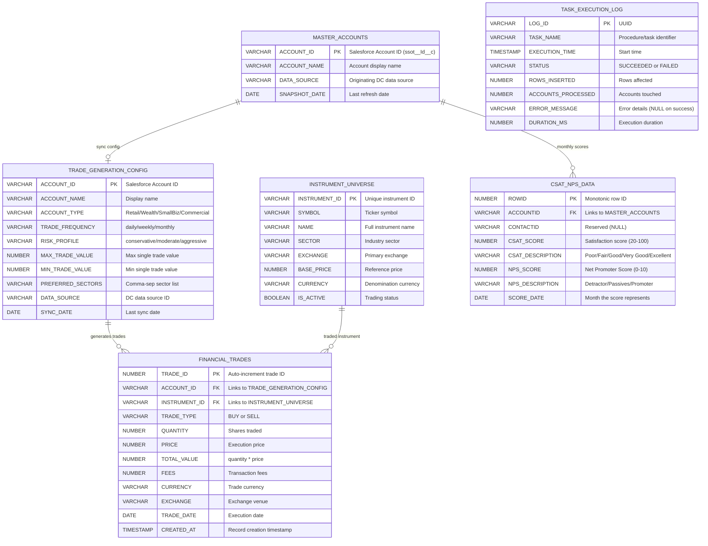
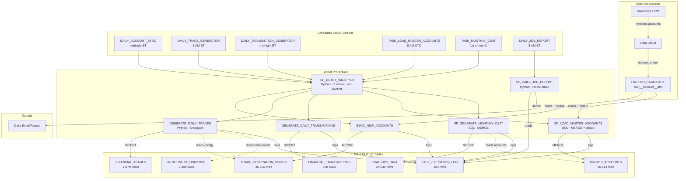
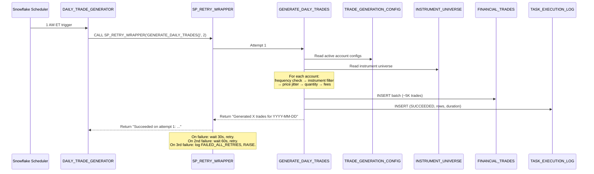

# Architecture

Detailed architecture of the Snowflake data pipelines in `FINS.PUBLIC`.

---

## Entity Relationship Diagram



---

## Data Flow



---

## Daily Pipeline Sequence



---

## Master Accounts Sync Sequence


---

## Warehouse Strategy

| Warehouse | Size | Auto-Suspend | Purpose | Tasks |
|-----------|------|--------------|---------|-------|
| MAIN_WH_XS | X-Small | 60s | Default; lightweight queries | TASK_LOAD_MASTER_ACCOUNTS, TASK_MONTHLY_CSAT |
| TASK_WH | X-Small | 60s | General task execution | DAILY_ACCOUNT_SYNC, DAILY_TRANSACTION_GENERATOR, DAILY_JOB_REPORT_TASK |
| LARGE_LOAD | X-Large | 300s | Heavy compute (trade gen) | DAILY_TRADE_GENERATOR |
| DC_CONNECTION | X-Small | 600s | Data Cloud connector queries | Manual / ad-hoc |
| LOAD_WH | X-Small | 60s | Legacy / one-time loads | Manual |

---

## Retry Strategy (SP_RETRY_WRAPPER)

All scheduled tasks invoke their target procedure through `SP_RETRY_WRAPPER`:

```sql
CALL FINS.PUBLIC.SP_RETRY_WRAPPER('FINS.PUBLIC.GENERATE_DAILY_TRADES()', 2);
```

| Attempt | Wait Before | Action |
|---------|-------------|--------|
| 1 | — | Execute procedure |
| 2 | 30 seconds | Retry on exception |
| 3 | 60 seconds | Retry on exception |
| — | — | Log `FAILED_ALL_RETRIES` to TASK_EXECUTION_LOG, then RAISE |

The wrapper is **Snowpark Python** (`EXECUTE AS OWNER`) so it can call arbitrary procedures by name and catch Snowflake exceptions generically.

---

## Key Design Decisions

| Decision | Rationale |
|----------|-----------|
| **MERGE + ROW_NUMBER dedup** on account sync | Data Cloud `ssot__Account__dlm` contains duplicate rows per account from multi-source ingestion. ROW_NUMBER collapses duplicates before MERGE prevents "Duplicate row detected" errors. |
| **HASH-based pseudo-randomness** (not RANDOM()) | Deterministic: `HASH(ACCOUNT_ID \|\| date)` produces the same score/trade for the same inputs. Enables reproducibility and debugging without seed management. |
| **Retry wrapper as shared utility** | Transient failures (warehouse contention, datashare latency) are common in scheduled pipelines. Centralized retry with exponential backoff avoids duplicating logic across procedures. |
| **Single TASK_EXECUTION_LOG** for all pipelines | Unified monitoring, alerting, and daily reporting. One table to query for health across both projects. |
| **Daily email report** | Immediate visibility into pipeline health without needing to log into Snowsight. Red/green HTML report makes failures obvious. |
| **EXECUTE AS OWNER** on datashare-reading SPs | Avoids granting inbound share privileges to the task-runner role; owner (SYSADMIN) has the share grants. |
| **One row per account** in MASTER_ACCOUNTS (not daily snapshots) | Historical tracking isn't needed — downstream consumers want "current state." MERGE in-place is simpler and eliminates table growth. |
| **X-Large warehouse for trades only** | Trade generation processes 36K+ accounts with instrument filtering, price computation, and batch inserts. XS would take 10x longer and risk timeout. All other tasks are lightweight. |
