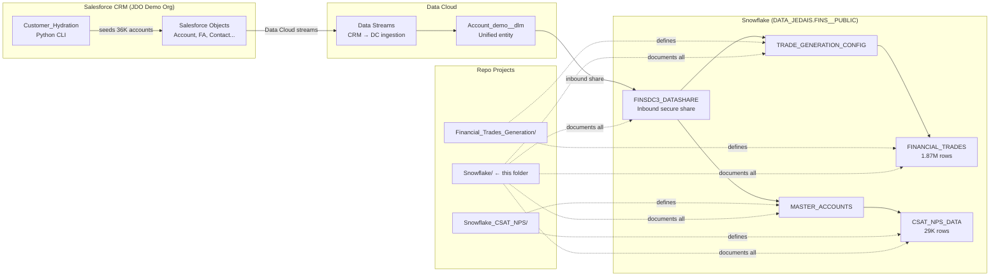
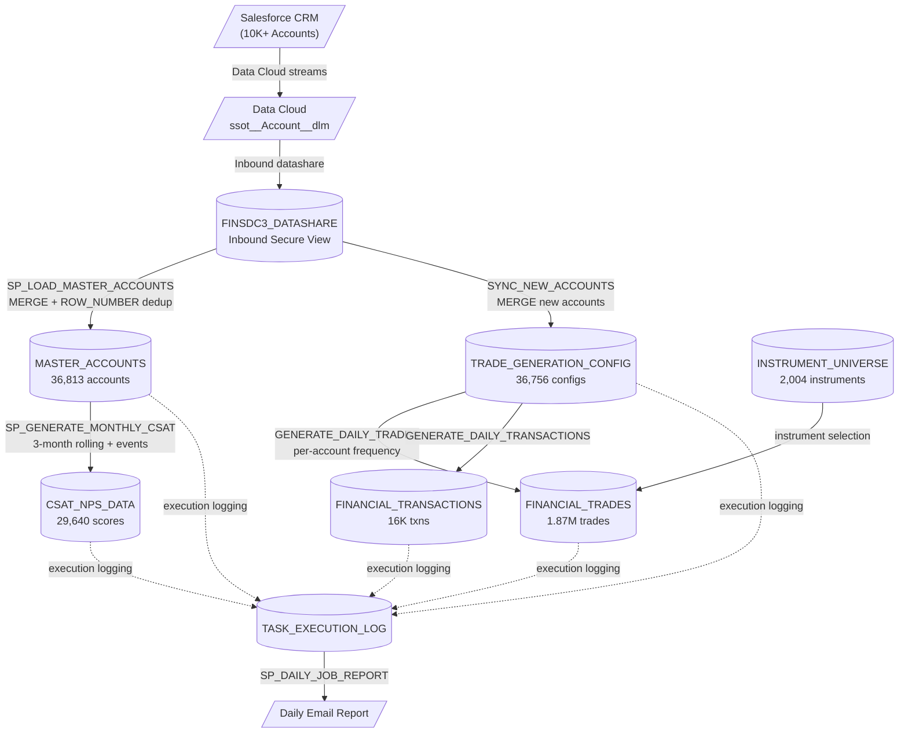
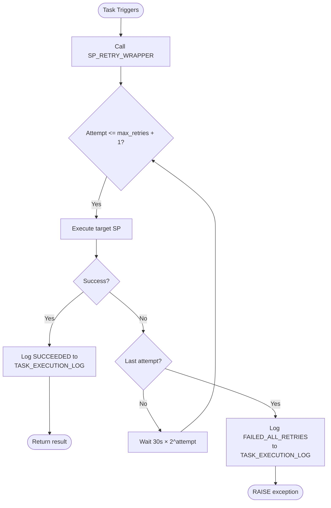
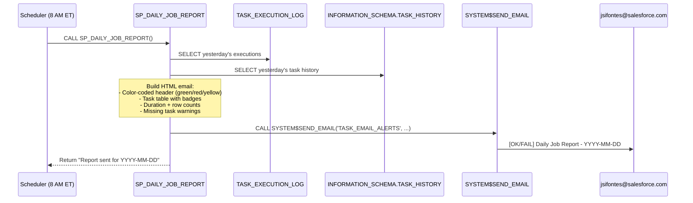
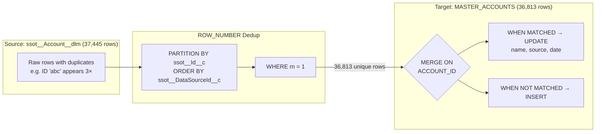

# Diagrams

Consolidated Mermaid diagram reference for the Snowflake data pipelines.

> All diagrams render natively in GitHub markdown. No external image files needed.
>
> **Multi-org Phase A live as of 2026-05-29.** `MASTER_ACCOUNTS` and the 13 Cumulus dataset tables now carry `ORG_ID VARCHAR(18) DEFAULT 'JDO'` as the leading column. For the Cumulus-family lineage diagram see [`ARCHITECTURE.md`](ARCHITECTURE.md#cumulus-dataset-family-13-plans-397m-rows). Per-org rollout runbook: [`../../Snowflake_Cumulus_Common/docs/ROLLOUT.md`](../../Snowflake_Cumulus_Common/docs/ROLLOUT.md).

---

## Monorepo Snowflake Landscape

How the Snowflake layer fits within the JDO monorepo:

---

## Data Lineage (End-to-End)

Full lineage from Salesforce CRM to final Snowflake tables:

---

## Daily Execution Timeline

Visual timeline of task execution order across a typical day:

```mermaid
gantt
    title Daily Pipeline Execution (US Eastern)
    dateFormat HH:mm
    axisFormat %H:%M

    section Account Sync
    DAILY_ACCOUNT_SYNC (SYNC_NEW_ACCOUNTS)    :a1, 00:00, 2min
    TASK_LOAD_MASTER_ACCOUNTS (SP_LOAD_MA)    :a2, 01:00, 1min

    section Data Generation
    DAILY_TRADE_GENERATOR (trades)            :g1, 01:00, 5min
    DAILY_TRANSACTION_GENERATOR (txns)        :g2, 00:00, 1min

    section Reporting
    DAILY_JOB_REPORT_TASK (email)             :r1, 08:00, 1min

    section Monthly (1st only)
    TASK_MONTHLY_CSAT (scores)                :m1, 02:00, 2min
```

---

## Retry Wrapper Flow

Decision flow for `SP_RETRY_WRAPPER`:

---

## Email Alerting Flow

How `SP_DAILY_JOB_REPORT` generates and sends the daily email:

---

## MERGE Deduplication Pattern

How `SP_LOAD_MASTER_ACCOUNTS` handles Data Cloud source duplicates:

