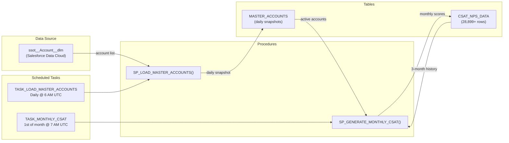

# CSAT & NPS Score Generation System

<div align="center">

[](https://www.snowflake.com/)
[](https://docs.snowflake.com/en/sql-reference/stored-procedures-overview)
[](https://developer.salesforce.com/docs/data/data-cloud-query-guide/guide/query-guide-get-started.html)

[](https://docs.snowflake.com/en/user-guide/tasks-intro)
[](schemas/csat_nps_data.sql)
[](schemas/master_accounts.sql)

[](https://github.com/josers18/JDO)

**Snowflake-native** · **Automated pipeline** · **Synthetic CSAT & NPS data**

</div>

A Snowflake-native automated pipeline that generates realistic synthetic Customer Satisfaction (CSAT) and Net Promoter Score (NPS) data for 741 accounts sourced from Salesforce Data Cloud. Includes a historical backfill (Jan 2023 -- Mar 2026) and an ongoing monthly auto-generation process with context-aware scoring.

## Data at a Glance

| Metric | Value |
|---|---|
| Total score records | 28,899 |
| Active accounts | 741 |
| Date range | January 2023 -- present |
| Months covered | 39+ |
| Average CSAT | 70.1 |
| Average NPS | 6.5 |
| Promoters (NPS 9-10) | 2,672 (9.2%) |
| Passives (NPS 7-8) | 12,720 (44.0%) |
| Detractors (NPS 0-6) | 13,507 (46.7%) |

## Architecture



## Pipeline Schedule

| Time (UTC) | Task | Procedure | Purpose |
|---|---|---|---|
| 6:00 AM daily | `TASK_LOAD_MASTER_ACCOUNTS` | `SP_LOAD_MASTER_ACCOUNTS()` | Snapshot all accounts from Data Cloud |
| 7:00 AM 1st of month | `TASK_MONTHLY_CSAT` | `SP_GENERATE_MONTHLY_CSAT()` | Generate CSAT/NPS scores for previous month |

The daily account sync ensures the latest account list is available before the monthly scoring procedure runs.

## Database Objects

### Tables

| Table | Rows | Purpose |
|---|---|---|
| [`CSAT_NPS_DATA`](schemas/csat_nps_data.sql) | 28,899+ | Monthly CSAT and NPS scores per account (8 columns) |
| [`MASTER_ACCOUNTS`](schemas/master_accounts.sql) | ~1,373/day | Daily snapshot of Salesforce Data Cloud accounts |

### Stored Procedures

| Procedure | Purpose |
|---|---|
| [`SP_GENERATE_MONTHLY_CSAT()`](procedures/sp_generate_monthly_csat.sql) | Generate monthly scores with 3-month lookback and event model |
| [`SP_LOAD_MASTER_ACCOUNTS()`](procedures/sp_load_master_accounts.sql) | Daily snapshot from Salesforce Data Cloud datashare |
| [`historical_backfill.sql`](procedures/historical_backfill.sql) | One-time backfill: 28,892 rows across 741 accounts (reference only) |

### Scheduled Tasks

| Task | Schedule | Definition |
|---|---|---|
| [`TASK_LOAD_MASTER_ACCOUNTS`](tasks/task_load_master_accounts.sql) | Daily 6 AM UTC | `CALL SP_LOAD_MASTER_ACCOUNTS()` |
| [`TASK_MONTHLY_CSAT`](tasks/task_monthly_csat.sql) | 1st of month 7 AM UTC | `CALL SP_GENERATE_MONTHLY_CSAT()` |

## Score Generation Model

### Monthly Auto-Generation

Each month, a new score is generated per account using:

1. **Baseline**: 3-month rolling CSAT average (or 65 for new accounts)
2. **Event injection**: Pseudo-random events via `HASH(ACCOUNT_ID || month)`
3. **NPS correlation**: Derived from CSAT via piecewise linear mapping

| Event | Probability | Impact |
|---|---|---|
| Negative event | 15% | -10 to -20 CSAT points |
| Positive event | 15% | +8 to +15 CSAT points |
| Normal drift | 70% | +/- 5 CSAT points |

### Historical Backfill (5 Archetypes)

| Archetype | Share | Trajectory |
|---|---|---|
| Positive | 30% | Starts ~55, trends up to ~85 |
| Negative | 20% | Starts ~75, trends down to ~40 |
| Neutral | 30% | Stable ~67 with minor noise |
| Recovery | 10% | V-shaped: dips then recovers |
| Volatile | 10% | Wild swings between 40-80 |

### CSAT-to-NPS Mapping

| CSAT Range | Description | NPS Range | NPS Category |
|---|---|---|---|
| 91 - 100 | Excellent | 9 - 10 | Promoter |
| 81 - 90 | Very Good | 8 - 9 | Passives / Promoter |
| 66 - 80 | Good | 6 - 8 | Passives |
| 51 - 65 | Fair | 4 - 6 | Detractor / Passives |
| 20 - 50 | Poor | 1 - 4 | Detractor |

## Quick Start

```sql
-- Generate scores for last month (idempotent)
CALL DATA_JEDAIS.FINS__PUBLIC.SP_GENERATE_MONTHLY_CSAT();

-- Refresh account master list
CALL DATA_JEDAIS.FINS__PUBLIC.SP_LOAD_MASTER_ACCOUNTS();

-- View latest scores
SELECT * FROM DATA_JEDAIS.FINS__PUBLIC.CSAT_NPS_DATA
ORDER BY SCORE_DATE DESC, ACCOUNTID
LIMIT 20;

-- Check score distribution by month
SELECT SCORE_DATE, COUNT(*) AS accounts,
       ROUND(AVG(CSAT_SCORE), 1) AS avg_csat,
       ROUND(AVG(NPS_SCORE), 1) AS avg_nps
FROM DATA_JEDAIS.FINS__PUBLIC.CSAT_NPS_DATA
GROUP BY SCORE_DATE
ORDER BY SCORE_DATE;

-- Verify task schedules
SHOW TASKS IN SCHEMA DATA_JEDAIS.FINS__PUBLIC;
```

## Data Source Breakdown

741 accounts from 8 Salesforce Data Cloud sources:

| Source | Accounts |
|---|---|
| CumulusWebsite_userProfile | 652 |
| Salesforce_InsuranceAFDC | 167 |
| Salesforce_Home | 159 |
| Salesforce_FinsDC4 | 146 |
| Salesforce_FinsDC1 | 127 |
| Salesforce_DCCDO1 | 89 |
| CumulusWebsite_Identity | 28 |
| CumulusWebProfilesSQL | 5 |

> Note: Accounts may appear in multiple sources; 741 is the distinct count.

## Detailed Documentation

- [Architecture and Data Flow](docs/architecture.md) -- ER diagrams, data flow, sequence diagrams, design decisions
- [Score Generation Logic](docs/score_generation_logic.md) -- Archetype formulas, CSAT-NPS correlation, event probability model
- [Historical Backfill](docs/historical_backfill.md) -- Methodology, row counts, verification queries

## Snowflake Environment

| Setting | Value |
|---|---|
| Database | `FINS` |
| Schema | `PUBLIC` |
| Warehouse | `MAIN_WH_XS` (X-Small) |
| Role | `SYSADMIN` |
| Source Database | `FINSDC3_DATASHARE` (inbound datashare) |
| Source Table | `"schema_Jedi_Snowflake"."ssot__Account__dlm"` |
