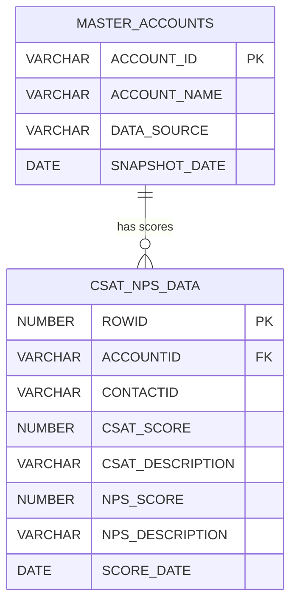
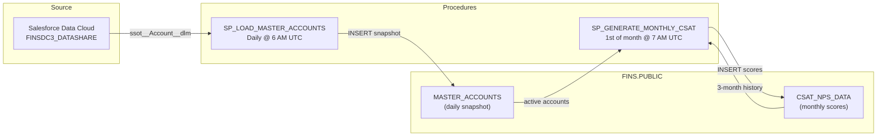
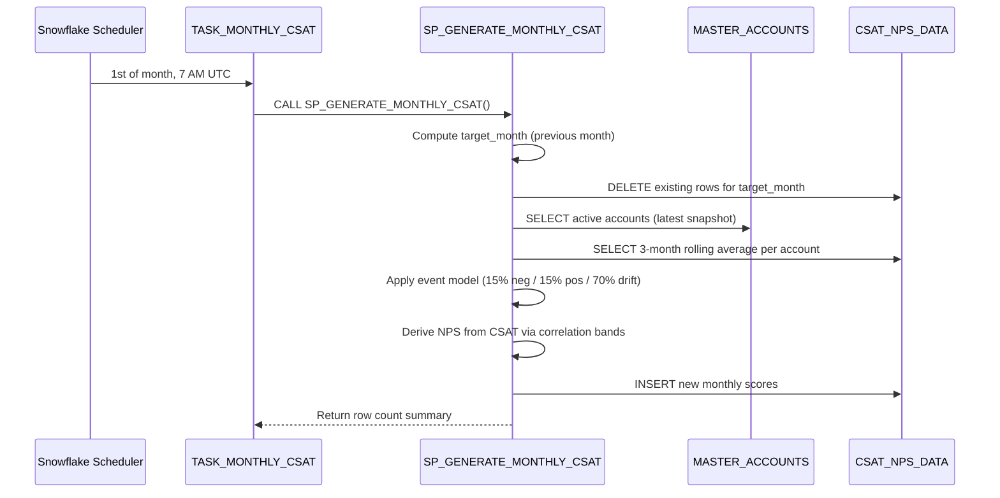
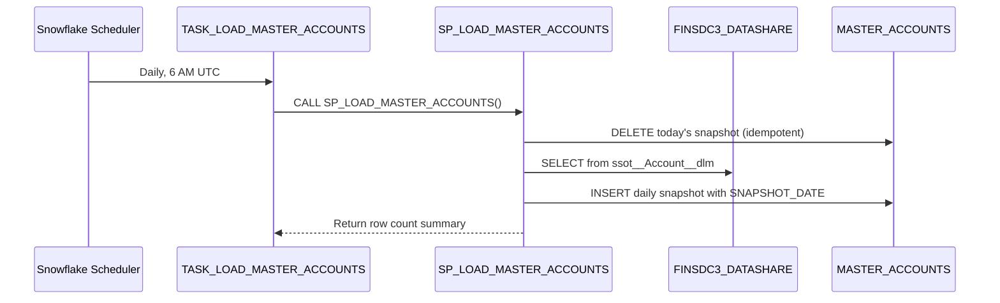

# Architecture

## Entity-Relationship Diagram

## Data Flow

## Monthly Pipeline Sequence

## Daily Account Sync Sequence

## Warehouse Strategy

| Warehouse | Size | Usage | Schedule |
|-----------|------|-------|----------|
| `MAIN_WH_XS` | X-Small | Daily account sync | Every day 6 AM UTC |
| `MAIN_WH_XS` | X-Small | Monthly CSAT/NPS generation | 1st of month 7 AM UTC |

Both tasks use `MAIN_WH_XS` (X-Small) as the workload is lightweight -- daily syncs process ~1,400 rows and monthly generation produces ~741 rows.

## Key Design Decisions

| Decision | Rationale |
|----------|-----------|
| **Daily snapshots** instead of live views | Track account additions/removals over time; avoid dependency on datashare availability |
| **HASH-based pseudo-randomness** | Deterministic: same account + date always produces same score, enabling reproducible results |
| **3-month rolling average** baseline | Prevents sudden, unrealistic jumps; scores evolve naturally from recent history |
| **15/15/70 event model** | ~30% of accounts experience a significant event each month, matching real-world CSAT volatility |
| **CSAT-to-NPS correlation** | Ensures metrics move together realistically; eliminates contradictory score combinations |
| **Idempotent procedures** | DELETE-before-INSERT pattern allows safe re-runs without data duplication |
| **Dollar-sign delimiters** (`$$`) | Required for Snowflake SQL procedures containing semicolons in the body |
| **`(SELECT CURRENT_DATE)`** wrapper | Snowflake SQL Scripting quirk: `CURRENT_DATE` must be in query context inside `LET` |
