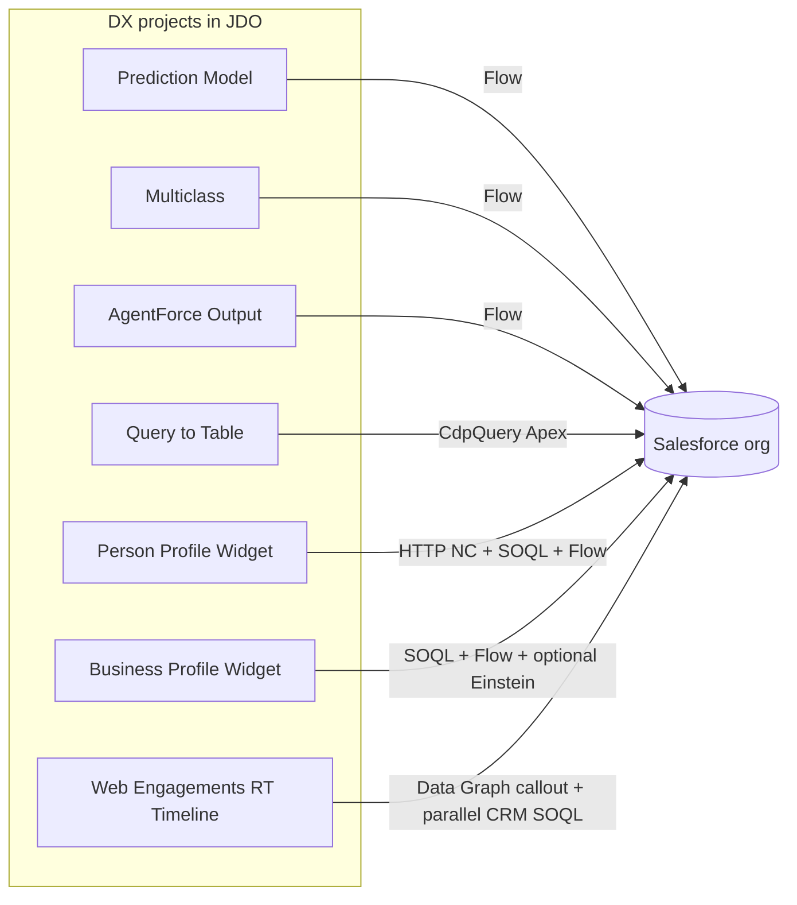
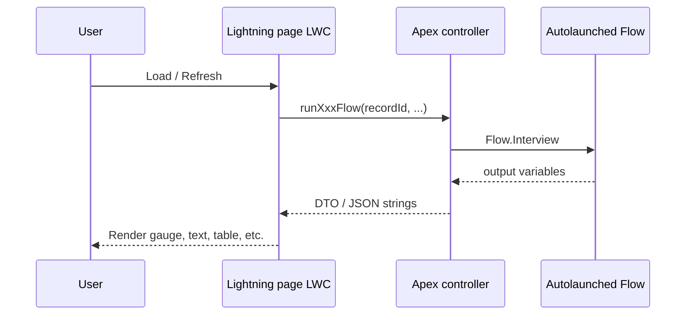
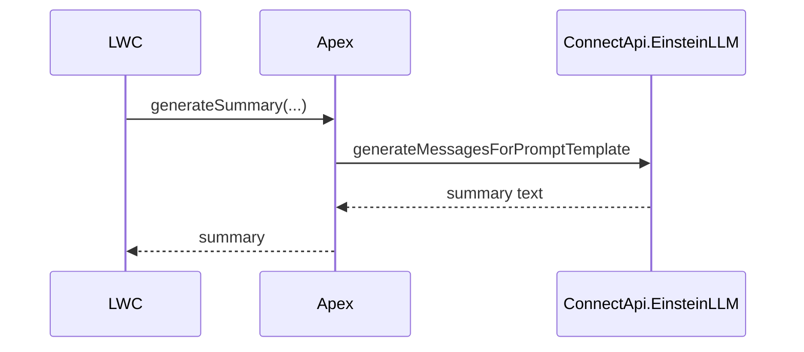
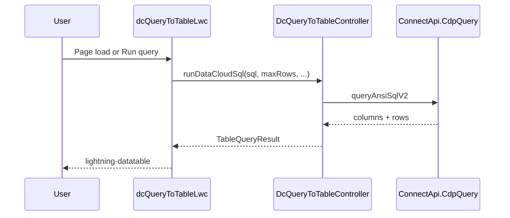
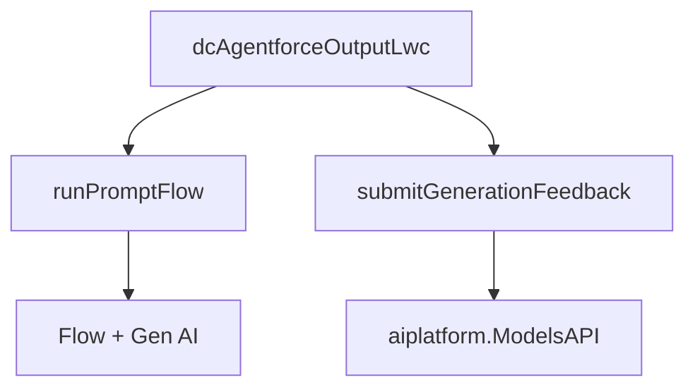

# Diagrams (Mermaid)

Render these in GitHub, VS Code (Mermaid preview), or any Markdown tool that supports Mermaid.

## Monorepo → org



## Flow-driven components (pattern)



Optional **Einstein** path (Prediction / Multiclass):



## DC Query to Table (Data Cloud)



## AgentForce Output (optional feedback)



For more sequence detail, see [DC_AgentForce_Output_LWC/docs/ARCHITECTURE.md](../DC_AgentForce_Output_LWC/docs/ARCHITECTURE.md).

## Web Engagements RT Timeline (multi-source, parallel)

```mermaid
sequenceDiagram
    participant LWC as webEngagementData
    participant DCC as DataCloudWebEngagementController
    participant CRM as CrmTimelineController
    participant DG as Data Cloud Data Graph
    participant Org as Salesforce SOQL
    LWC->>DCC: Promise A — getWebEngagementData(accountId, dataGraphName)
    LWC->>CRM: Promise B — getCrmTimelineEvents(recordId, sources, lookbackDays)
    DCC->>DG: callout:Data_Cloud_API + Unified ID lookup
    DG-->>DCC: Data Graph JSON
    DCC-->>LWC: TimelineEvent[] (source: 'web')
    CRM->>Org: per-source SOQL fan-out (Case / Task / Event / VoiceCall)
    Org-->>CRM: rows
    CRM-->>LWC: TimelineEvent[] (sorted DESC, LIMIT 200 per source)
    Note over LWC: A renders immediately; B streams in below.<br/>Chip filters operate client-side, no re-fetch.
```

Promise A is never blocked on Promise B. Filter chips re-render visible events without firing Apex. Partial-failure UX surfaces inline retry banners for whichever side failed; the working side keeps showing.
