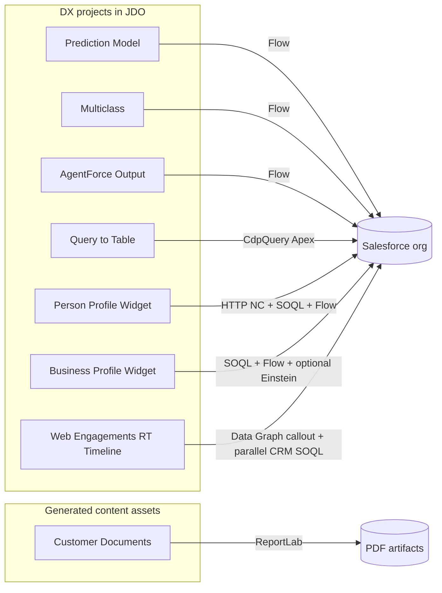
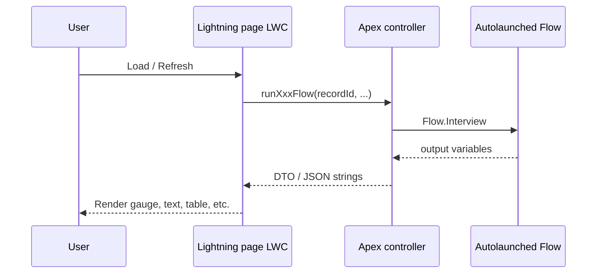
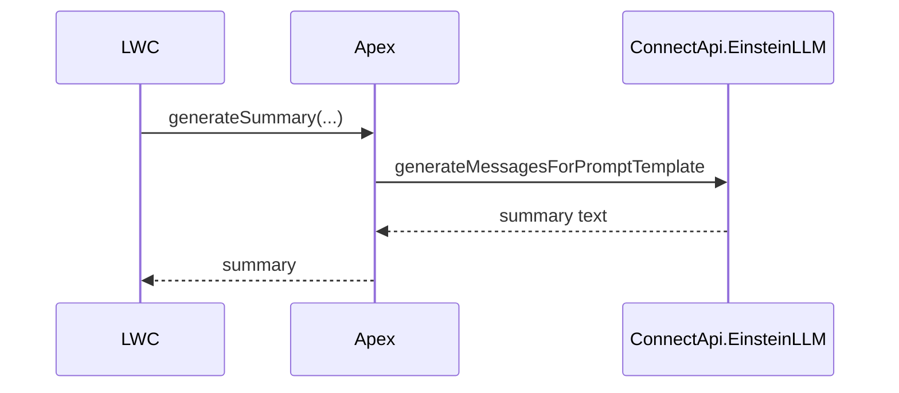
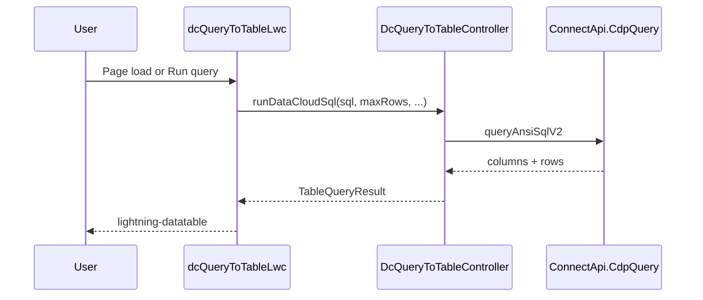
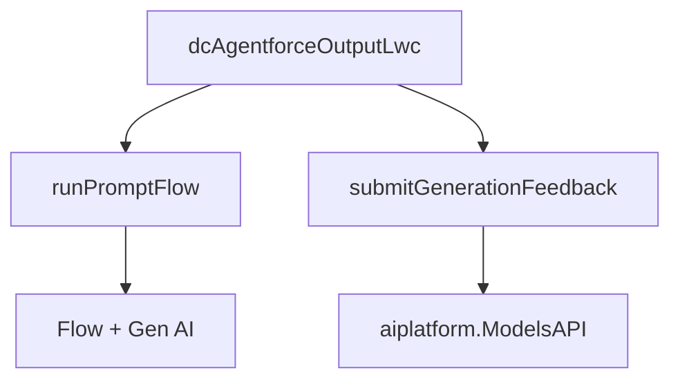
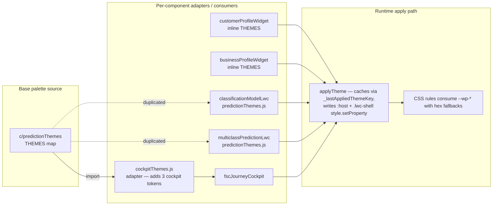
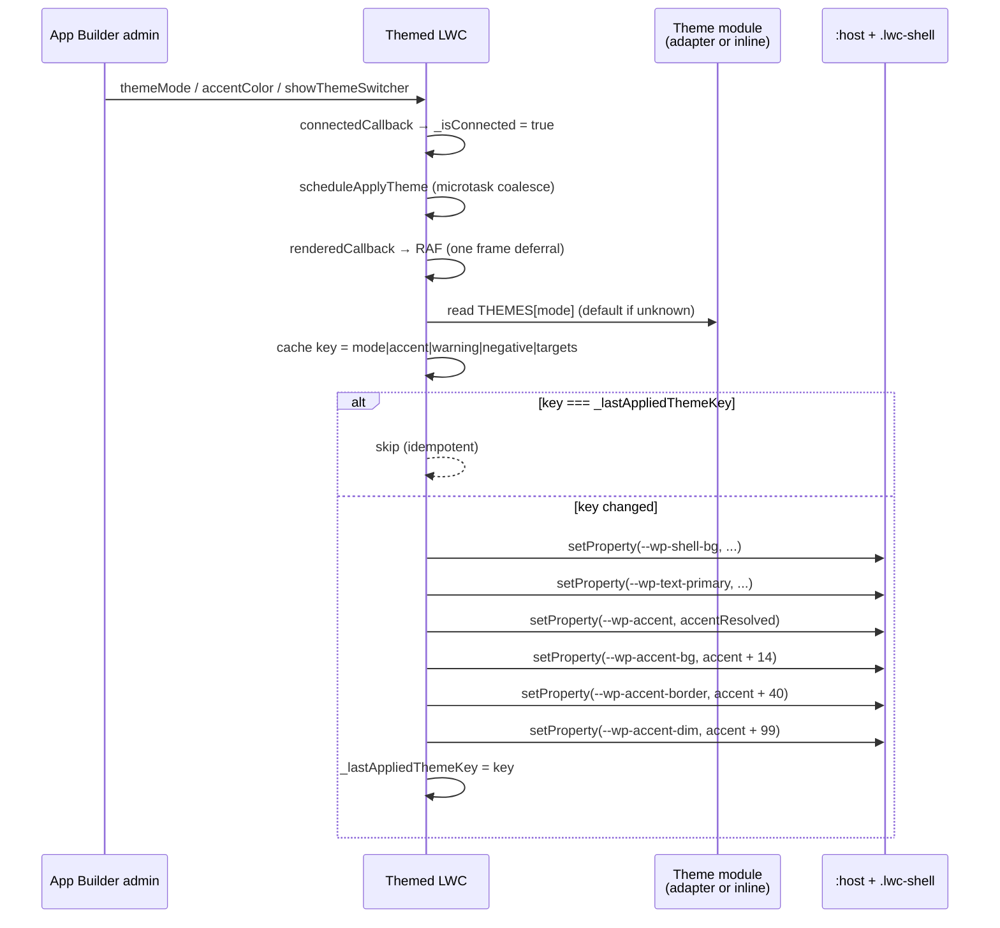

# Diagrams (Mermaid)

Render these in GitHub, VS Code (Mermaid preview), or any Markdown tool that supports Mermaid.

## Monorepo → org



## Flow-driven components (pattern)



Optional **Einstein** path (Prediction / Multiclass):



## DC Query to Table (Data Cloud)



## AgentForce Output (optional feedback)



For more sequence detail, see [DC_AgentForce_Output_LWC/docs/ARCHITECTURE.md](../DC_AgentForce_Output_LWC/docs/ARCHITECTURE.md).

## Web Engagements RT Timeline (multi-source, parallel; hot cache + cold-store backfill)

```mermaid
sequenceDiagram
    participant LWC as webEngagementData
    participant DCC as DataCloudWebEngagementController
    participant CRM as CrmTimelineController
    participant DG as Data Cloud Data Graph
    participant DMO as CumulusWeb_Engagements__dlm
    participant Org as Salesforce SOQL
    LWC->>DCC: Promise A — getWebEngagementsWithBackfill(accountId, dataGraphName, lookbackDays)
    LWC->>CRM: Promise B — getCrmTimelineEvents(recordId, sources, lookbackDays)
    DCC->>DG: HOT — callout:Data_Cloud_API + Unified ID lookup
    DG-->>DCC: Data Graph envelope (may have empty events array after cache expiration)
    DCC->>DMO: COLD — ConnectApi.CdpQuery.querySql JOIN UnifiedLinkssotAccountAcc__dlm
    DMO-->>DCC: Historical events for this unified individual
    Note over DCC: Merge: dedupe by eventId__c, hot wins on collision.<br/>Cold-side failures are caught + logged; response degrades to hot-only.
    DCC-->>LWC: TimelineEvent[] (source: 'web') in the same envelope shape
    CRM->>Org: per-source SOQL fan-out (Case / Task / Event / VoiceCall)
    Org-->>CRM: rows
    CRM-->>LWC: TimelineEvent[] (sorted DESC, LIMIT 200 per source)
    Note over LWC: A renders immediately; B streams in below.<br/>Chip filters operate client-side, no re-fetch.
```

Promise A is never blocked on Promise B. The hot+cold merge happens server-side inside Promise A, so the LWC consumes hot-only and hot+cold responses identically — `parseDataGraphResponse` is unchanged. Filter chips re-render visible events without firing Apex. Partial-failure UX surfaces inline retry banners for whichever side failed; the working side keeps showing.

## Theme system — `--wp-*` token flow across the LWC family



The **adapter pattern** (`cockpitThemes.js` → `c/predictionThemes`) is the recommended path for new components — it eliminates the "keep these files identical" duplication that bridges `classificationModelLwc` ↔ `multiclassPredictionLwc`. Full contract, lifecycle canon, and copy-paste skeleton in [THEME_CATALOG.md](THEME_CATALOG.md).



Key invariants (drift here causes the FOUC and "first load shows wrong theme" bugs that bit earlier components): `_isConnected` re-entry guard, `_animationPending` + `requestAnimationFrame` (NOT `setTimeout`), `_lastAppliedThemeKey` cache, two-target apply (`:host` + `.lwc-shell`), 8-char hex alpha-strip on the accent. See the **Why each piece exists** table in [THEME_CATALOG.md §3](THEME_CATALOG.md#3-lifecycle-canon).
