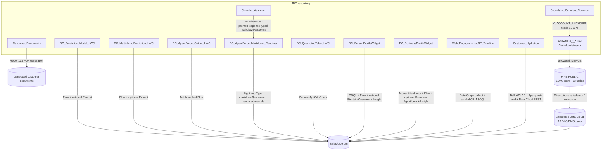

# Monorepo overview

## What lives here

Each top-level folder that contains `sfdx-project.json` is a **complete DX project**. There is no shared `force-app` at the repository root; deploy **from the project directory** you care about. Content-generation folders, such as `Customer_Documents`, are local generator assets rather than DX deployments.



## Naming vs App Builder labels

| Folder / bundle API name | App Builder (master label) |
|---------------------------|----------------------------|
| `classificationModelLwc` | Prediction Model |
| `multiclassPredictionLwc` | Multiclass Prediction |
| `dcAgentforceOutputLwc` | DC AgentForce Output |
| `markdownRenderer` | Markdown Renderer (Lightning Type `markdownResponse` renderer override; accepts markdown OR HTML input) |
| `aiAuthoringBundles/Cumulus_Assistant` | Cumulus Assistant (Agentforce agent bundle, employee assistant template) |
| `dcQueryToTableLwc` | DC Query to Table |
| `customerProfileWidget` | Customer Profile Widget |
| `businessProfileWidget` | Business Profile Widget |
| `webEngagementData` | Real Time Digital Engagements |
| `customer_hydration` (Python) | Customer Hydration CLI |
| `customer_documents` (Python) | Customer document generator |
| `Snowflake_Cumulus_Common` (Python + SQL) | Cumulus pipelines foundation (V_ACCOUNT_ANCHORS, helpers) |
| `Snowflake_*_*` × 13 (Python + SQL) | Cumulus dataset SPs — see [ROLLOUT.md](../Snowflake_Cumulus_Common/docs/ROLLOUT.md) |

Historical Apex class names (e.g. `ClassificationModelLwcController`) are kept for stable upgrades in orgs that already deployed earlier versions.

## Clone and work on one project

```bash
git clone https://github.com/josers18/JDO.git
cd JDO/DC_Query_to_Table_LWC
sf org login web --alias my-org --set-default
sf project deploy start --source-dir force-app --target-org my-org
```

Repeat with a different subdirectory for other packages.

## Coexistence in one org

- **Prediction Model** and **Multiclass Prediction** use **different** Apex classes and LWC bundle names; both can deploy to the same org.
- **AgentForce Output** and **Query to Table** are independent packages as well.
- Watch for overlapping **permission sets** or **flow API names** only if you name new org metadata identically to samples shipped in-repo.
